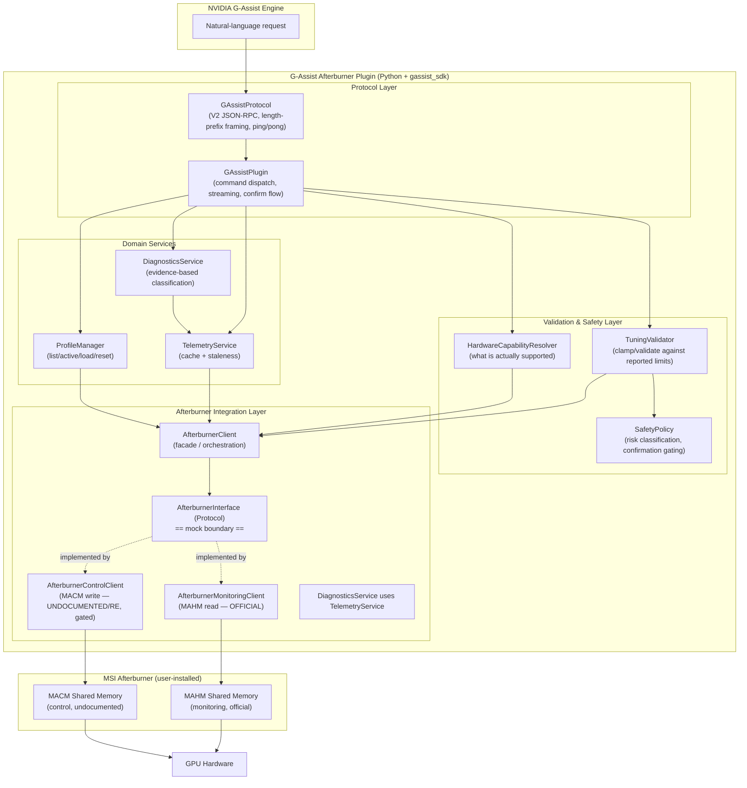

# Design Document: NVIDIA G-Assist Plugin for MSI Afterburner

## Overview

This plugin lets users monitor and control MSI Afterburner through NVIDIA G-Assist
using natural language ("what's my GPU doing?", "make my GPU quieter", "why is my
clock dropping?"). It is a Python plugin built on the official `gassist_sdk`, speaking
G-Assist Plugin **Protocol V2** over stdin/stdout. It integrates with a **user-installed**
copy of MSI Afterburner — it never bundles or redistributes Afterburner or RTSS.

Monitoring is built on Afterburner's **officially shipped** MAHM shared-memory interface.
Control is built on the **undocumented / reverse-engineered** MACM shared-memory interface,
which is isolated behind the smallest possible interface, gated by runtime capability
detection, and requires explicit user confirmation for risky operations. If control is
unavailable, monitoring and diagnostics still work and the plugin returns clear,
actionable "unavailable" responses instead of failing.

The design prioritizes **reliability, safety, maintainability, and compatibility over
maximizing the number of exposed controls.**

---

## Technical Feasibility Report

### Recommended Integration Mechanism

| Concern | Decision |
|---|---|
| Runtime / language | **Python + official `gassist_sdk`** (SDK-recommended, first-class, minimal boilerplate, direct `.py` execution — no compile-to-exe) |
| G-Assist protocol | **Protocol V2** (mandatory; V1 legacy is no longer supported) |
| Monitoring interface | **MAHM shared memory** ("MAHMSharedMemory") — read-only telemetry |
| Control interface | **MACM shared memory** — capability-gated, confirmation-gated, degrades gracefully |
| Afterburner binaries | **Never bundled/redistributed** — integrate with user-installed copy, detect at runtime |

### Interface Availability & Status (labeled honestly)

The design distinguishes four levels of API trust and treats them very differently:

| Interface | Status | Trust Level | Usage in this plugin |
|---|---|---|---|
| **G-Assist Plugin SDK / Protocol V2** | Official, current (NVIDIA/G-Assist repo, `PLUGIN_MIGRATION_GUIDE_V2.md`) | **Official / documented** | Full reliance. Transport, health, method contract. |
| **MAHM Shared Memory (monitoring)** | Officially shipped C header `MAHMSharedMemory.h` (ships with Afterburner since v4.6.0, 2019) | **Officially provided SDK-level functionality** | Primary monitoring source. Read-only. Safest, best-supported. |
| **Community MAHM wrappers** (aleab/MSIAfterburnerNET, dejectedarcher/MSIAB_MAHM_CS) | Third-party, mirror the same layout | **Reference only** | Cross-check struct layout; the shipped header is authoritative. |
| **MACM Shared Memory (control)** | Largely **undocumented / reverse-engineered**; no broadly distributed official write-control header | **Undocumented / RE — highest risk** | Isolated, capability-gated, confirmation-gated, optional. |

> **Explicit flag:** The MACM control path is the single undocumented / reverse-engineered
> mechanism in this design. It is the *only* known way to actuate Afterburner controls
> programmatically. It historically requires the Afterburner process running and typically
> **elevated privileges**, and its layout can change between releases. We therefore:
> (a) verify its presence and shape at runtime via capability detection rather than
> assuming; (b) isolate it behind the smallest possible `AfterburnerControlClient`
> interface; (c) require explicit user confirmation for risky writes; and (d) degrade
> gracefully so that monitoring/diagnostics remain fully functional when control is absent.
>
> **The safer alternative was chosen as the foundation:** MAHM monitoring is fully
> supported and covers the majority of user value (status, limits, tuning state,
> diagnostics). Control is an *additive, optional* capability layered on top.

### Limitations

- **Control is not guaranteed.** MACM may be unavailable, may require elevation, or may
  differ across Afterburner versions. The plugin must never assume it works.
- **Afterburner must be running** for control (and for live telemetry). If Afterburner is
  closed, MAHM shared memory is not published — monitoring returns an "unavailable" state.
- **Profile create/update is unreliable** via these interfaces. The plugin uses Afterburner
  as the source of truth and reliably supports **list / identify-active / load / reset**;
  create/update are marked best-effort or unavailable.
- **Per-GPU capability varies.** Voltage/power/offset/fan support differs per GPU; the
  plugin reads Afterburner-reported capability flags and min/max limits rather than
  hardcoding assumptions.
- **Telemetry can go stale** when Afterburner restarts or disconnects; the plugin timestamps
  reads and detects staleness.

### Licensing / Redistribution Concerns

- **Only MSI and Guru3D may legally distribute** MSI Afterburner and RivaTuner Statistics
  Server binaries. Therefore this plugin **MUST NOT bundle, redistribute, or install**
  Afterburner or RTSS. It integrates with the user's existing installation and detects its
  presence.
- The `MAHMSharedMemory.h` layout may be **referenced for interop**, but no Afterburner
  binaries are redistributed.
- **RTSS** ships alongside Afterburner (OSD / framerate). It is **not required** for the core
  monitoring/control use cases here and is **out of scope** (possible optional future work).

### Security Risks & Posture

- **No** process injection, DLL injection, arbitrary memory writes to arbitrary targets,
  shell/command execution, or filesystem manipulation beyond the plugin's own config/logs.
- The MACM shared-memory writes are the single privileged/undocumented operation. They are
  isolated behind `AfterburnerControlClient`, only ever write **validated, clamped** values
  to **known control fields**, and are never exposed as a generic "write arbitrary value to
  arbitrary offset" capability. The LLM never supplies raw values directly to the interface.
- Requires user-installed Afterburner; the plugin may need to run with the privileges
  Afterburner's control interface requires (documented in the error/UX flow, not silently
  escalated).

### Realistic Functionality (what will actually work)

| Category | Realistic outcome |
|---|---|
| **Monitoring** | Fully works whenever Afterburner is running (temp, hotspot, utilization, clocks, voltage, power, power-limit %, fan %/RPM, memory usage, GPU name). |
| **Limits & tuning state** | Read reliably from Afterburner-reported capability flags + min/max fields. |
| **Diagnostics** | Works from monitoring alone; evidence-based classification, no false certainty. |
| **Profiles** | List / identify-active / load / reset reliably; create/update best-effort or unavailable. |
| **Control (power/offset/fan/curve)** | Works **only when** MACM capability detected + supported by hardware + user confirms risky changes; otherwise cleanly unavailable. |

### Proposed Architecture Summary

A layered design cleanly separates the **G-Assist protocol layer** from the **Afterburner
integration layer**, with a dedicated **validation/safety layer** in between. An abstract
`AfterburnerInterface` (Python `Protocol`) sits at the boundary so the entire stack is
**unit-testable with mocks — no real GPU or Afterburner required.**

`G-Assist ⟶ GAssistPlugin/Protocol ⟶ Intent & command validation (TuningValidator + SafetyPolicy)
⟶ AfterburnerClient ⟶ (MAHM monitoring / capability-gated MACM control) ⟶ MSI Afterburner ⟶ GPU`

---

## Architecture

### Architecture Diagram



### Component Responsibilities

| Component | Responsibility |
|---|---|
| **GAssistProtocol** | Protocol V2 transport: 4-byte big-endian length-prefixed JSON-RPC 2.0 over stdin/stdout; `initialize`/`ping`/`execute`/`input`/`shutdown` handling; `stream`/`complete`/`error`/`log` notifications. In practice delegated to `gassist_sdk`. |
| **GAssistPlugin** | Registers commands (`@plugin.command`), maps `execute` calls to domain services, formats NL-friendly responses, drives the confirmation flow, manages `keep_session`. |
| **AfterburnerClient** | Facade over the integration layer; orchestrates monitoring + control, exposes a clean domain API to services. Holds the `AfterburnerInterface` implementation. |
| **AfterburnerInterface** (Protocol) | The **mock boundary**. Abstract contract for detect/read-telemetry/read-limits/read-profiles/apply-control. Real impls talk to MAHM/MACM; tests use a fake. |
| **AfterburnerMonitoringClient** | Reads MAHM shared memory; parses header + GPU entries into typed telemetry & limits. Read-only, official. |
| **AfterburnerControlClient** | Writes MACM control fields (`dwCommand` + validated values). Undocumented/RE; isolated, capability-gated, confirmation-gated. Never a generic memory writer. |
| **HardwareCapabilityResolver** | Determines supported controls from Afterburner capability flags + min/max fields + MACM availability + version. Answers "is voltage/power/offset/fan control available?" |
| **TuningValidator** | Validates & **clamps** requested values against reported limits and capability flags; validates fan curves (monotonic temps, bounds). Rejects unsupported features. |
| **SafetyPolicy** | Classifies operations as low-friction vs. risky; decides which need explicit confirmation; owns confirm-token lifecycle. |
| **TelemetryService** | Caches telemetry with timestamps; enforces staleness thresholds; prevents high-frequency polling; surfaces "stale" clearly. |
| **ProfileManager** | list / identify-active / load / reset; marks create/update best-effort or unavailable. |
| **DiagnosticsService** | Gathers telemetry and classifies likely performance limiter with supporting evidence and honest uncertainty. |
| **DiagnosticsService / SafetyPolicy / errors** | Produce typed errors mapped to user-facing messages and Protocol V2 error codes. |

### Data Flow

**Monitoring (`get_gpu_status`)**
1. G-Assist sends `execute` → `GAssistProtocol` decodes → `GAssistPlugin` dispatches.
2. `TelemetryService.get_status()` checks cache; if stale, calls `AfterburnerClient` → `AfterburnerMonitoringClient` → MAHM.
3. Typed `GpuTelemetry` (with timestamp) returned; plugin formats NL response; `complete` notification sent.

**Risky control (`set_power_limit`)**
1. `execute` → dispatch. `HardwareCapabilityResolver` confirms power control is supported.
2. `TuningValidator` clamps/validates the value against reported min/max.
3. `SafetyPolicy` marks it risky → plugin issues a **confirmation** request (confirm token / passthrough `input`), does not apply yet.
4. On user confirmation, `AfterburnerControlClient` writes the validated value to MACM; `complete` sent. If control unavailable → typed error → clear "unavailable" message.

**Diagnostics (`diagnose_performance`)**
1. `DiagnosticsService` pulls current telemetry (via `TelemetryService`) → runs classification → returns cause + evidence + confidence (or "insufficient data").

### Data Modeling Approach (overview)

Strongly-typed Python `dataclasses` / `typing` (pydantic optional) model: **GPU telemetry**,
**tuning state**, **limits & capabilities**, **profiles**, **fan curves**, **commands/args**,
**control results**, **diagnostics results**, and a **typed error taxonomy**. All values that
cross the LLM boundary are validated/clamped before reaching the Afterburner interface.


---

## Data Models

Strongly-typed Python `dataclasses` / `typing` model the domain. All values that cross the
LLM boundary are validated/clamped before reaching the Afterburner interface.

### Strongly-Typed Models (dataclasses / typing)

```python
from __future__ import annotations
from dataclasses import dataclass, field
from datetime import datetime
from enum import Enum
from typing import Optional, Protocol, Sequence, runtime_checkable

# ---- Availability & capabilities -------------------------------------------

class InterfaceStatus(str, Enum):
    OK = "ok"
    NOT_INSTALLED = "not_installed"          # Afterburner not found on disk
    NOT_RUNNING = "not_running"              # installed but process/shared-mem absent
    UNSUPPORTED_VERSION = "unsupported_version"
    ACCESS_DENIED = "access_denied"          # needs elevation
    UNAVAILABLE = "unavailable"              # interface present but non-functional

class ControlFeature(str, Enum):
    POWER_LIMIT = "power_limit"
    CORE_OFFSET = "core_offset"
    MEMORY_OFFSET = "memory_offset"
    VOLTAGE = "voltage"
    FAN_PERCENT = "fan_percent"
    FAN_CURVE = "fan_curve"
    PROFILE_LOAD = "profile_load"
    PROFILE_RESET = "profile_reset"

@dataclass(frozen=True)
class Range:
    min: float
    max: float
    def clamp(self, value: float) -> float:
        return max(self.min, min(self.max, value))
    def contains(self, value: float) -> bool:
        return self.min <= value <= self.max

@dataclass(frozen=True)
class GpuLimits:
    """Afterburner-REPORTED limits (never hardcoded per-GPU)."""
    power_limit_pct: Optional[Range] = None      # e.g. 50..120 (%)
    core_offset_mhz: Optional[Range] = None
    memory_offset_mhz: Optional[Range] = None
    voltage_mv: Optional[Range] = None
    fan_percent: Optional[Range] = None          # usually 0..100
    fan_temp_c: Optional[Range] = None           # valid temp axis for curve points

@dataclass(frozen=True)
class GpuCapabilities:
    gpu_index: int
    gpu_name: str
    supported_controls: frozenset[ControlFeature]
    limits: GpuLimits
    control_interface_status: InterfaceStatus   # MACM availability for this GPU
    def supports(self, f: ControlFeature) -> bool:
        return f in self.supported_controls

# ---- Telemetry --------------------------------------------------------------

@dataclass(frozen=True)
class GpuTelemetry:
    gpu_index: int
    gpu_name: str
    temperature_c: Optional[float] = None
    hotspot_c: Optional[float] = None
    utilization_pct: Optional[float] = None
    core_clock_mhz: Optional[float] = None
    memory_clock_mhz: Optional[float] = None
    voltage_mv: Optional[float] = None
    power_watts: Optional[float] = None
    power_limit_pct: Optional[float] = None
    fan_percent: Optional[float] = None
    fan_rpm: Optional[float] = None
    memory_used_mb: Optional[float] = None
    memory_total_mb: Optional[float] = None
    sampled_at: datetime = field(default_factory=datetime.utcnow)
    is_stale: bool = False

@dataclass(frozen=True)
class TuningState:
    gpu_index: int
    power_limit_pct: Optional[float] = None
    core_offset_mhz: Optional[float] = None
    memory_offset_mhz: Optional[float] = None
    voltage_mv: Optional[float] = None
    fan_mode: str = "auto"                 # "auto" | "manual" | "curve"
    fan_percent: Optional[float] = None

# ---- Profiles & fan curves --------------------------------------------------

@dataclass(frozen=True)
class Profile:
    id: int                                # hardware profile 1..5 or user profile id
    name: str
    is_active: bool = False
    kind: str = "hardware"                 # "hardware" | "user"

@dataclass(frozen=True)
class FanCurvePoint:
    temp_c: float
    fan_percent: float

@dataclass(frozen=True)
class FanCurve:
    points: tuple[FanCurvePoint, ...]

# ---- Commands, results, errors ---------------------------------------------

class RiskLevel(str, Enum):
    LOW = "low"          # no confirmation (reads, reset_tuning, load_profile)
    HIGH = "high"        # requires explicit confirmation

@dataclass(frozen=True)
class ControlResult:
    feature: ControlFeature
    requested_value: Optional[float]
    applied_value: Optional[float]         # after clamping; None if not applied
    clamped: bool = False
    applied: bool = False
    message: str = ""

class ErrorCode(str, Enum):
    NOT_INSTALLED = "afterburner_not_installed"
    NOT_RUNNING = "afterburner_not_running"
    UNSUPPORTED_VERSION = "unsupported_version"
    UNSUPPORTED_GPU = "unsupported_gpu"
    INTERFACE_UNAVAILABLE = "interface_unavailable"
    ACCESS_DENIED = "access_denied"
    INVALID_VALUE = "invalid_tuning_value"
    LIMIT_VIOLATION = "hardware_limit_violation"
    COMM_FAILURE = "communication_failure"
    STALE_TELEMETRY = "stale_telemetry"
    UNSUPPORTED_FEATURE = "unsupported_feature"
    DISCONNECTED = "afterburner_disconnecting"
    CONFIRMATION_REQUIRED = "confirmation_required"

@dataclass(frozen=True)
class PluginError(Exception):
    code: ErrorCode
    user_message: str                      # NL-friendly, returned to G-Assist
    detail: str = ""                       # internal / log only

class DiagnosisCause(str, Enum):
    THERMAL = "thermal"
    POWER = "power"
    VOLTAGE = "voltage"
    UTILIZATION_BOTTLENECK = "utilization_bottleneck"
    CPU_LIMITED = "cpu_limited"
    APP_BEHAVIOR = "app_behavior"
    UNKNOWN_INSUFFICIENT_DATA = "unknown_insufficient_data"

@dataclass(frozen=True)
class Diagnosis:
    cause: DiagnosisCause
    confidence: float                      # 0.0..1.0 — never overclaim
    evidence: tuple[str, ...]              # human-readable supporting facts
    summary: str
```

## Components and Interfaces

This section defines the abstract Afterburner adapter contract (the mock boundary), the
low-level algorithms that the domain services implement, the G-Assist function/command
definitions, the confirmation flow, caching strategy, and the plugin manifest shape.

### Afterburner Adapter Interface (Protocol — the mock boundary)

The entire stack depends only on this abstraction. Real implementations wrap MAHM/MACM;
unit tests inject `FakeAfterburner`. **No real GPU or Afterburner is needed for unit tests.**

```python
@runtime_checkable
class AfterburnerInterface(Protocol):
    def detect(self) -> InterfaceStatus:
        """Is Afterburner installed & running; is shared memory readable?"""

    def get_version(self) -> Optional[str]: ...

    # --- Monitoring (MAHM — official, read-only) ---
    def read_telemetry(self, gpu_index: int) -> GpuTelemetry: ...
    def read_all_telemetry(self) -> Sequence[GpuTelemetry]: ...
    def read_capabilities(self, gpu_index: int) -> GpuCapabilities: ...
    def read_tuning_state(self, gpu_index: int) -> TuningState: ...

    # --- Profiles (Afterburner is source of truth) ---
    def list_profiles(self) -> Sequence[Profile]: ...
    def load_profile(self, profile_id: int) -> ControlResult: ...
    def reset_tuning(self, gpu_index: int) -> ControlResult: ...

    # --- Control (MACM — undocumented/RE, capability-gated) ---
    # Implementations MUST write only known control fields with validated,
    # clamped values. There is NO generic write(offset, value) method by design.
    def apply_control(self, gpu_index: int,
                      feature: ControlFeature,
                      value: float) -> ControlResult: ...
    def apply_fan_curve(self, gpu_index: int, curve: FanCurve) -> ControlResult: ...
```

> Note the deliberate absence of any `write(offset, bytes)` primitive. The LLM (and even
> callers) can only request *named, validated* controls — never arbitrary memory writes.

### Key Algorithms

#### Capability Resolution

```pascal
ALGORITHM resolveCapabilities(gpu_index)
INPUT: gpu_index
OUTPUT: GpuCapabilities

BEGIN
  status ← interface.detect()
  IF status ≠ OK THEN
    RETURN capabilities with supported_controls = ∅ AND control_interface_status = status
  END IF

  caps ← interface.read_capabilities(gpu_index)   // from MAHM capability flags + min/max

  supported ← ∅
  FOR each feature IN {POWER_LIMIT, CORE_OFFSET, MEMORY_OFFSET, VOLTAGE, FAN_PERCENT}
    IF caps.flags indicate feature supported AND caps.limits.<feature> ≠ NULL THEN
      supported ← supported ∪ {feature}
    END IF
  END FOR

  // Control features additionally require a functional MACM interface
  macm ← interface.control_status(gpu_index)
  IF macm ≠ OK THEN
    // monitoring-only: expose reads, mark control features as unavailable
    caps.control_interface_status ← macm
    supported ← supported ∩ {reads-only}   // drop write-capable features
  END IF

  // Profiles: load/reset reliably supported; create/update excluded
  supported ← supported ∪ {PROFILE_LOAD, PROFILE_RESET}
  RETURN caps with supported_controls = supported
END
```

**Rule:** a control command is only *offered/executable* when hardware supports it AND the
installed Afterburner + MACM support it. Unsupported features are never exposed.

#### Tuning Validation & Clamping

```pascal
ALGORITHM validateAndClamp(gpu_index, feature, requested_value)
INPUT: gpu_index, feature ∈ ControlFeature, requested_value : float
OUTPUT: (safe_value : float, clamped : bool)
PRECONDITION: requested_value comes from the LLM and is UNTRUSTED

BEGIN
  caps ← resolveCapabilities(gpu_index)

  IF NOT caps.supports(feature) THEN
    RAISE PluginError(UNSUPPORTED_FEATURE, "This GPU/Afterburner does not support " + feature)
  END IF

  range ← caps.limits.rangeFor(feature)
  IF range = NULL THEN
    RAISE PluginError(INTERFACE_UNAVAILABLE, "No reported limits for " + feature)
  END IF

  IF requested_value is NaN OR not finite THEN
    RAISE PluginError(INVALID_VALUE, "That value isn't a valid number.")
  END IF

  safe_value ← range.clamp(requested_value)
  clamped ← (safe_value ≠ requested_value)
  RETURN (safe_value, clamped)
END
```

- The **LLM never supplies raw values directly** to the interface. Values are always clamped
  to Afterburner-reported min/max before any write.
- Clamping is reported back so G-Assist can tell the user ("I set it to the max supported 118%").

#### Fan Curve Validation

```pascal
ALGORITHM validateFanCurve(gpu_index, curve)
INPUT: gpu_index, curve : FanCurve
OUTPUT: safe_curve : FanCurve
BEGIN
  caps ← resolveCapabilities(gpu_index)
  IF NOT caps.supports(FAN_CURVE) THEN
    RAISE PluginError(UNSUPPORTED_FEATURE, "Fan curve control isn't available on this setup.")
  END IF

  IF curve.points.length < 2 THEN
    RAISE PluginError(INVALID_VALUE, "A fan curve needs at least two points.")
  END IF

  temp_range ← caps.limits.fan_temp_c
  fan_range  ← caps.limits.fan_percent

  prev_temp ← -∞
  safe_points ← []
  FOR each p IN curve.points (in given order) DO
    // Monotonic non-decreasing temperature ordering
    IF p.temp_c < prev_temp THEN
      RAISE PluginError(INVALID_VALUE, "Fan curve temperatures must not decrease.")
    END IF
    // Bounds on temp and fan% (clamp into reported ranges)
    t ← temp_range.clamp(p.temp_c)
    f ← fan_range.clamp(p.fan_percent)
    safe_points.append(FanCurvePoint(t, f))
    prev_temp ← t
  END FOR

  RETURN FanCurve(points = safe_points)
END
```

Invariant: output temps are monotonic non-decreasing and every point lies within
Afterburner-reported temp/fan bounds.

#### Diagnostics Classification (evidence-based, no false certainty)

```pascal
ALGORITHM diagnosePerformance(gpu_index)
INPUT: gpu_index
OUTPUT: Diagnosis
BEGIN
  t ← telemetryService.get(gpu_index)          // cached, timestamped

  IF t.is_stale OR essential fields missing THEN
    RETURN Diagnosis(UNKNOWN_INSUFFICIENT_DATA, confidence=0.2,
                     evidence=["telemetry unavailable or stale"],
                     summary="I don't have enough live data to be sure.")
  END IF

  evidence ← []
  // Ordered heuristics; collect evidence rather than assert one true cause
  IF t.temperature_c ≥ thermal_threshold(caps) THEN
     evidence.append("GPU at " + t.temperature_c + "C, near thermal limit")
     candidate ← THERMAL
  ELSE IF t.power_limit_pct present AND power-limited signal THEN
     evidence.append("Power draw pinned at the power limit")
     candidate ← POWER
  ELSE IF voltage-limited signal THEN
     evidence.append("Core voltage capped")
     candidate ← VOLTAGE
  ELSE IF t.utilization_pct < low_util_threshold THEN
     evidence.append("GPU utilization only " + t.utilization_pct + "%")
     candidate ← CPU_LIMITED or APP_BEHAVIOR   // distinguish if data allows
  ELSE
     candidate ← UTILIZATION_BOTTLENECK or UNKNOWN_INSUFFICIENT_DATA
  END IF

  confidence ← scoreConfidence(evidence, data completeness)   // capped; never 1.0 on inference
  RETURN Diagnosis(candidate, confidence, evidence, summarize(candidate, evidence))
END
```

Principle: **classify with evidence, report confidence honestly, and prefer
`UNKNOWN_INSUFFICIENT_DATA` over guessing.** Never present inference as certainty.

### G-Assist Function / Command Definitions (NL-friendly)

The `name`, `description`, and `properties` below are what G-Assist uses to map natural
language to operations, so descriptions are written for NL mapping. Control functions are
only listed when capability detection reports them as supported.

| Function | Risk | NL-friendly description (for mapping) |
|---|---|---|
| `get_gpu_status` | low | "Report current GPU status: temperature, clocks, utilization, power, fan speed, memory usage." |
| `get_gpu_limits` | low | "Show the supported tuning ranges (min/max power, clock offsets, fan) reported by Afterburner." |
| `get_tuning_state` | low | "Show the GPU's current tuning: power limit, core/memory offsets, voltage, fan mode." |
| `get_profiles` | low | "List Afterburner profiles and indicate which one is active." |
| `show_configuration` | low | "Summarize the detected Afterburner setup, interface status, and available controls." |
| `load_profile` | low | "Load an existing Afterburner profile by name or number." |
| `reset_tuning` | low | "Reset GPU tuning back to default / stock settings." |
| `set_power_limit` | high | "Set the GPU power limit as a percentage, within supported limits." |
| `set_core_offset` | high | "Adjust the GPU core clock offset in MHz, within supported limits." |
| `set_memory_offset` | high | "Adjust the GPU memory clock offset in MHz, within supported limits." |
| `set_fan_percent` | high | "Set a fixed GPU fan speed percentage." |
| `set_fan_curve` | high | "Set a custom fan curve as temperature/fan-percent points." |
| `optimize_quiet` | high | "Make the GPU quieter by lowering fan noise while keeping temps safe." (maps to fan/thermal intent) |
| `optimize_thermal` | high | "Keep the GPU below a target temperature (e.g. 70C) by adjusting fan/thermal behavior." |
| `diagnose_performance` | low | "Explain what's limiting GPU performance / why the clock is dropping, with evidence." |

Higher-level intents (`optimize_quiet`, `optimize_thermal`) map to focused fan/thermal
optimization — they do **not** trigger unrelated granular tuning changes.

### Confirmation Flow (for high-risk operations)

Two supported mechanisms; the plugin prefers a **confirm-token** pattern and can fall back to
passthrough `input`.

```pascal
ALGORITHM executeRisky(function, args, context)
BEGIN
  (safe_value, clamped) ← validateAndClamp(...)          // always validate first

  IF SafetyPolicy.risk(function) = HIGH AND NOT context.confirmed THEN
     token ← SafetyPolicy.issueConfirmToken(function, safe_value)   // short TTL, single-use
     plugin.set_keep_session(true)
     RETURN complete(success=true, data={
        needs_confirmation: true,
        confirm_token: token,
        message: "This will set " + function + " to " + safe_value +
                 (clamped ? " (clamped to supported range)" : "") +
                 ". Reply 'confirm' to apply."
     })
  END IF

  // Confirmed path: token validated & consumed, or context.confirmed passthrough ack
  IF NOT SafetyPolicy.validateToken(context.token) THEN
     RAISE PluginError(CONFIRMATION_REQUIRED, "Please confirm the change first.")
  END IF

  result ← afterburnerClient.apply(...safe_value...)
  RETURN complete(success=result.applied, data=result)
END
```

- **Risky** (require confirmation): `set_power_limit`, `set_core_offset`, `set_memory_offset`,
  `set_fan_percent`, `set_fan_curve`, `optimize_*`.
- **Low-friction** (no confirmation): all reads, `reset_tuning`, `load_profile`.
- Passthrough `input` acks must be sent within **2s** (Protocol V2); the confirm-token pattern
  avoids blocking on that window.

### Caching & Staleness Strategy

```python
TELEMETRY_TTL_SECONDS = 1.0     # serve cached reads within this window
STALE_THRESHOLD_SECONDS = 3.0   # older than this => is_stale=True (Afterburner likely gone)
MIN_POLL_INTERVAL_SECONDS = 0.5 # never poll MAHM faster than this
```

- `TelemetryService` returns cached telemetry within `TELEMETRY_TTL_SECONDS`, preventing
  high-frequency polling.
- Every `GpuTelemetry` carries `sampled_at`; if the underlying MAHM timestamp/counter stops
  advancing or age exceeds `STALE_THRESHOLD_SECONDS`, `is_stale=True` so G-Assist never treats
  stale values as current.
- Startup is fast: capability detection + a single telemetry read; if Afterburner is absent,
  the plugin loads normally and monitoring/diagnostics degrade to clear "unavailable" responses.

### manifest.json Shape

```json
{
  "manifestVersion": 1,
  "name": "afterburner",
  "version": "1.0.0",
  "description": "Monitor and control MSI Afterburner via natural language.",
  "protocol_version": "2.0",
  "executable": "plugin.py",
  "persistent": true,
  "functions": [
    {
      "name": "get_gpu_status",
      "description": "Report current GPU temperature, clocks, utilization, power, fan speed and memory usage from MSI Afterburner.",
      "tags": ["gpu", "monitoring", "status", "temperature"],
      "properties": {
        "gpu_index": { "type": "integer", "description": "Which GPU (default 0)." }
      },
      "required": []
    },
    {
      "name": "set_power_limit",
      "description": "Set the GPU power limit as a percentage, clamped to Afterburner-reported supported range. Requires confirmation.",
      "tags": ["gpu", "control", "power", "overclock"],
      "properties": {
        "gpu_index": { "type": "integer", "description": "Which GPU (default 0)." },
        "percent": { "type": "number", "description": "Target power limit percentage." },
        "confirm_token": { "type": "string", "description": "Confirmation token from the prior step." }
      },
      "required": ["percent"]
    },
    {
      "name": "diagnose_performance",
      "description": "Explain what is limiting GPU performance or why clocks are dropping, using live telemetry and evidence.",
      "tags": ["gpu", "diagnostics", "troubleshooting", "performance"],
      "properties": {
        "gpu_index": { "type": "integer", "description": "Which GPU (default 0)." }
      },
      "required": []
    }
  ]
}
```

> Control functions (`set_*`, `optimize_*`) are declared but their execution is gated at
> runtime by `HardwareCapabilityResolver`; when unsupported they return a clear
> `UNSUPPORTED_FEATURE`/`INTERFACE_UNAVAILABLE` message rather than acting.

**Install / log locations (Protocol V2 conventions):**
`%PROGRAMDATA%\NVIDIA Corporation\nvtopps\rise\plugins\afterburner\` for the plugin;
logs at `...\rise\logs\` and per-plugin `afterburner.log`; bundled Python at
`...\rise\python\python.exe`, with `GA_PYTHON_DEV` override and system-PATH fallback;
the `gassist_sdk` is copied into the plugin's `libs/` folder (engine auto-adds it to `PYTHONPATH`).

---

## Error Handling

### Error Taxonomy → User-Facing Messages → Protocol Codes

| Condition | `ErrorCode` | Example user-facing message | V2 mapping |
|---|---|---|---|
| Afterburner not installed | `NOT_INSTALLED` | "MSI Afterburner doesn't appear to be installed." | `error` -1 |
| Installed, not running | `NOT_RUNNING` | "MSI Afterburner isn't running. Start it and try again." | -1 |
| Version too old | `UNSUPPORTED_VERSION` | "Your Afterburner version doesn't expose the needed interface. Please update." | -1 |
| GPU not supported | `UNSUPPORTED_GPU` | "This GPU isn't supported for that operation." | -1 |
| Control interface absent | `INTERFACE_UNAVAILABLE` | "Afterburner is installed but its control interface is unavailable. Start MSI Afterburner and try again." | -1 |
| Needs elevation | `ACCESS_DENIED` | "Controlling Afterburner needs elevated permissions. Run Afterburner (and G-Assist) with the required privileges." | -1 |
| Invalid value | `INVALID_VALUE` | "That value isn't valid for this control." | -32602 |
| Beyond limits | `LIMIT_VIOLATION` | "That exceeds the supported range; I clamped it to the max supported value." | -1 |
| Comms failure | `COMM_FAILURE` | "I couldn't read from Afterburner just now. Try again in a moment." | -1 |
| Stale data | `STALE_TELEMETRY` | "The readings are stale; Afterburner may be restarting." | -1 |
| Unsupported feature | `UNSUPPORTED_FEATURE` | "That control isn't available on this hardware/version." | -1 |
| Disconnecting | `DISCONNECTED` | "Afterburner disconnected mid-operation. Nothing was changed." | -1 |
| Timeout in engine | (SDK) | — | -2 |

All errors are returned to G-Assist via the `error`/`complete` notifications — the plugin
never crashes on these conditions.

---

## Correctness Properties

### Property 1: Clamping invariant — no raw LLM value reaches hardware

For every control write, the applied value equals `range.clamp(requested)` for the
Afterburner-reported range, so the applied value is always within limits:
`∀ writes: applied ∈ [min, max]`. No LLM-supplied value is ever written unclamped.

**Validates: Requirements 6.1, 6.2, 6.5, 5.4, 7.1, 13.5, 14.4**

- **Validation:** Property-based test that generates arbitrary requested values (including
  values far below `min`, far above `max`, and boundary values) against randomized reported
  ranges, and asserts the value handed to the adapter is always `∈ [min, max]`.

### Property 2: Capability gating — unsupported features are never actuated

A control is executed only if `capabilities.supports(feature) ∧ control_interface_status == OK`.
Whenever a feature is reported unsupported, the operation returns a typed error and never
performs a write.

**Validates: Requirements 5.3, 6.4, 7.1, 8.5**

- **Validation:** Property-based test over randomized capability sets; for every feature not in
  the supported set, assert the adapter write is never invoked and a typed `UNSUPPORTED_FEATURE`
  error is returned.

### Property 3: Fan-curve monotonicity and bounds

Any accepted fan curve has non-decreasing temperatures (monotonic non-decreasing fan output in
temperature), and every point lies within the reported temperature/fan bounds.

**Validates: Requirements 8.1, 8.2, 8.3, 8.4**

- **Validation:** Property-based test generating random candidate curves; assert accepted curves
  satisfy `∀ i: temp[i] ≤ temp[i+1]` and every `(temp, fan)` point is within reported bounds, and
  that any curve violating monotonicity or bounds is rejected.

### Property 4: Confirmation before high-risk operations

No HIGH-risk operation is applied without a valid, single-use, unexpired confirmation token
(or explicit passthrough confirmation). A missing, expired, or replayed token blocks the write.

**Validates: Requirements 9.1, 9.2, 9.3, 9.4, 11.4**

- **Validation:** Property-based test over the confirm-token lifecycle (issue/validate/expire/
  replay) asserting a high-risk write only occurs when a currently-valid token is presented and
  never on missing/expired/reused tokens.

### Property 5: Diagnostics never overclaim on stale or missing data

Telemetry flagged stale (or missing) never produces a confident diagnosis: confidence is always
`< 1.0` for any inferred cause, and insufficient data yields `UNKNOWN_INSUFFICIENT_DATA`.

**Validates: Requirements 12.3, 12.4**

- **Validation:** Property-based test injecting stale/missing/malformed telemetry; assert every
  inferred-cause diagnosis has `confidence < 1.0` and that insufficient inputs always return
  `UNKNOWN_INSUFFICIENT_DATA`.

### Property 6: No arbitrary memory access — only named validated controls

The adapter exposes no generic `write(offset, value)` primitive; only named, validated controls
exist (structural/security invariant).

**Validates: Requirements 14.1, 14.2, 14.3**

- **Validation:** Structural/API test asserting the adapter's public surface contains no generic
  memory-write primitive and only exposes the enumerated named controls, each routed through
  validation.

### Property 7: Graceful degradation — no crash when Afterburner is unavailable

If control/monitoring is unavailable, monitoring/control calls return a typed `PluginError` with
a user-facing message rather than crashing; monitoring/diagnostics remain available whenever MAHM
is.

**Validates: Requirements 2.6, 7.3, 7.4, 13.3, 16.2, 16.3**

- **Validation:** Property-based test simulating each unavailability mode (not installed, not
  running, interface absent, disconnected mid-op); assert every call returns a typed error with a
  user-facing message and never raises an unhandled exception.

### Property 8: Telemetry caching and rate invariant

Telemetry reads within the staleness window are served from cache and are not high-frequency
polled; any telemetry older than `STALE_THRESHOLD_SECONDS` (or from a stalled MAHM counter) is
flagged `is_stale=True`.

**Validates: Requirements 4.1, 4.2, 4.3**

- **Validation:** Property-based test issuing bursts of reads with randomized timing; assert reads
  inside the staleness window are served from cache (underlying poll count bounded by the rate
  limit) and reads past the threshold are flagged `is_stale=True`.

## Testing Strategy

**Unit tests (no GPU/Afterburner — inject `FakeAfterburner: AfterburnerInterface`):**
capability detection (supported/unsupported/mixed), tuning validation & clamping, fan-curve
validation (monotonicity, bounds, too-few points), profile handling (list/active/load/reset),
telemetry parsing (well-formed and **malformed** MAHM records), unsupported hardware/features,
safety boundaries (clamp at min/max, reject NaN/inf), confirmation-token lifecycle
(issue/validate/expire/replay), error-taxonomy → message mapping, staleness detection.

**Integration tests (where practical):** against a real user-installed Afterburner —
read-only monitoring smoke tests; control tests behind an explicit opt-in flag; version /
availability detection. These are optional and skipped in CI where no Afterburner is present.

## Dependencies & Deliverables

**Dependencies:** Python 3.x, official `gassist_sdk` (vendored into `libs/`), Windows shared-memory
access (via `mmap`/`ctypes`), a user-installed MSI Afterburner (v4.6.0+ for MAHM). No Afterburner
binaries are bundled.

**Deliverables (implementation phase):** working plugin; Afterburner integration layer
(MAHM monitoring + capability-gated MACM control); strongly-typed command/API layer; safety
validation layer; monitoring; profile support where available; diagnostics; automated tests
(mockable unit tests + optional integration tests); build/package scripts; installation
instructions; example G-Assist prompts; and documentation stating exactly which Afterburner
interfaces are used and their status (**official**: G-Assist V2, MAHM monitoring; **reference**:
community MAHM wrappers; **undocumented/RE**: MACM control).

## Sources (status labeled)

- **NVIDIA/G-Assist** GitHub repository, `PLUGIN_MIGRATION_GUIDE_V2.md` and `gassist_sdk` —
  *Official, current.* Protocol V2, transport/framing, method contract, timeouts, error codes,
  manifest fields, install/log locations, Python-first runtime. Content summarized/rephrased
  for compliance.
- **`MAHMSharedMemory.h`** shipped with MSI Afterburner (since v4.6.0, 2019) — *Officially
  provided SDK-level functionality.* Authoritative for monitoring struct layout.
- **aleab/MSIAfterburnerNET**, **dejectedarcher/MSIAB_MAHM_CS** — *Third-party community
  wrappers; reference only.* Mirror the MAHM layout; the shipped header is authoritative.
- **MACM control shared memory** — *Largely undocumented / reverse-engineered.* No broadly
  distributed official write-control header; treated as highest-risk and gated accordingly.
- **MSI / Guru3D redistribution terms** — Only MSI and Guru3D may distribute Afterburner/RTSS
  binaries; this plugin does not redistribute them.
