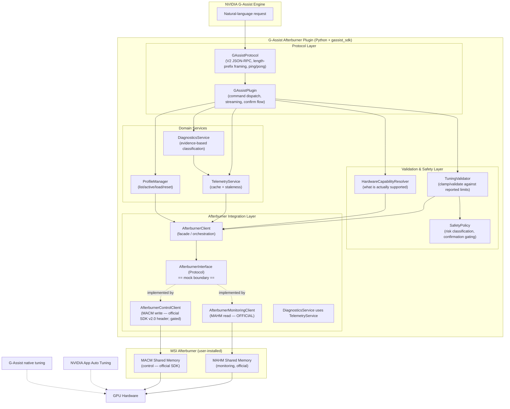

# Design Document: NVIDIA G-Assist Plugin for MSI Afterburner

## Overview

This plugin lets users monitor and control MSI Afterburner through NVIDIA G-Assist
using natural language ("what's my GPU doing?", "make my GPU quieter", "why is my
clock dropping?"). It is a Python plugin built on the official `gassist_sdk`, speaking
G-Assist Plugin **Protocol V2** over stdin/stdout. It integrates with a **user-installed**
copy of MSI Afterburner — it never bundles or redistributes Afterburner or RTSS.

Monitoring is built on Afterburner's **officially shipped** MAHM shared-memory interface.
Control is built on Afterburner's **officially shipped MACM SDK interface** — the install ships
`SDK\Include\MACMSharedMemory.h` and a runnable `MACMSharedMemorySample` under
`SDK\Samples\SharedMemory\` (verified on Afterburner 4.6.7; v2.0 header with `'MACM'` signature).
Control is isolated behind the smallest possible interface, gated by runtime capability
detection, and requires explicit user confirmation for risky operations. If control is
unavailable, monitoring and diagnostics still work and the plugin returns clear,
actionable "unavailable" responses instead of failing.

The design prioritizes **reliability, safety, maintainability, and compatibility over
maximizing the number of exposed controls.**

The GPU exposes one shared set of driver tuning parameters. G-Assist native tuning, NVIDIA App
Automatic Tuning, other OC utilities, and Afterburner (including its apply-at-Windows-startup
profile auto-apply) are all writers of that same state — their values do not stack. This design
therefore treats **Afterburner as the plugin's single tuning authority** (the plugin reads and
writes only through Afterburner) and is honest about ownership: only Afterburner-observable state
is ever reported, external authorities are reported as not observable, and every risky change
states what it replaces and warns that other tools may override or be overridden.

---

## Technical Feasibility Report

### Recommended Integration Mechanism

| Concern | Decision |
|---|---|
| Runtime / language | **Python + official `gassist_sdk`** (SDK-recommended, first-class, minimal boilerplate, direct `.py` execution — no compile-to-exe) |
| G-Assist protocol | **Protocol V2** (mandatory; V1 legacy is no longer supported) |
| Monitoring interface | **MAHM shared memory** ("MAHMSharedMemory") — read-only telemetry |
| Control interface | **MACM shared memory** — capability-gated, confirmation-gated, degrades gracefully |
| Afterburner binaries | **Never bundled/redistributed** — integrate with user-installed copy, detect at runtime |

### Interface Availability & Status (labeled honestly)

The design distinguishes four levels of API trust and treats them very differently:

| Interface | Status | Trust Level | Usage in this plugin |
|---|---|---|---|
| **G-Assist Plugin SDK / Protocol V2** | Official, current (NVIDIA/G-Assist repo, `PLUGIN_MIGRATION_GUIDE_V2.md`) | **Official / documented** | Full reliance. Transport, health, method contract. |
| **MAHM Shared Memory (monitoring)** | Officially shipped C header `MAHMSharedMemory.h` present in Afterburner installs; the interface predates v4.6.0 (v4.6.0 changelogs already cite years of third-party use). Validate shared-memory signature/version (v2.0) at runtime | **Officially provided SDK-level functionality** | Primary monitoring source. Read-only. Safest, best-supported. |
| **Community MAHM wrappers** (aleab/MSIAfterburnerNET, dejectedarcher/MSIAB_MAHM_CS) | Third-party, mirror the same layout | **Reference only** | Cross-check struct layout; the shipped header is authoritative. |
| **MACM Shared Memory (control)** | **Officially shipped SDK header** — `SDK\Include\MACMSharedMemory.h` plus a runnable `SDK\Samples\SharedMemory\MACMSharedMemorySample` ship with the install (verified on Afterburner 4.6.7). Header documents the v2.0 layout (`'MACM'` signature; the header's `dwVersion` comment says “must be set to `0x00020000` for v2.0”; FLUSH/REFRESH_VF_CURVE commands; typed GPU-entry fields incl. power/clock/fan/voltage(mV)/voltage-boost(mV)). At runtime the map carries the interface revision Afterburner actually implements — the live 4.6.7.17439 install reports `0x00020003` (v2.3) with an entry layout identical to the bound header — so the client validates the v2.x family plus entry-layout equality, not a strict `0x00020000` pin. Older releases may lack the SDK, so presence, signature, and shape are re-verified at runtime per release | **Official SDK-level functionality; per-release re-verification** | Isolated, capability-gated, confirmation-gated, optional. Bind to the installed header; where the SDK/interface is absent, control is capability-gated unavailable. |

> **Explicit flag:** The MACM control path is the most operationally sensitive mechanism in this
> design. MSI ships the interface officially — `SDK\Include\MACMSharedMemory.h` and a runnable
> `MACMSharedMemorySample` were verified in the Afterburner 4.6.7 SDK folder — but header presence
> and struct layout vary across releases (older installs may lack the SDK entirely), the interface
> historically requires the Afterburner process running and typically **elevated privileges**, and
> a mistaken control write affects live hardware. We therefore: (a) verify the shared-memory
> signature/version and bind structs to the installed header at runtime rather than assuming;
> (b) isolate control behind the smallest possible `AfterburnerControlClient` interface;
> (c) require explicit user confirmation for risky writes; and (d) degrade gracefully so that
> monitoring/diagnostics remain fully functional when control is absent.
>
> **The safer alternative was chosen as the foundation:** MAHM monitoring is fully
> supported and covers the majority of user value (status, diagnostics; limits and
> tuning-state reads where the control shared memory is readable). Control writes are an
> *additive, optional* capability layered on top.

### Limitations

- **Control is not guaranteed.** MACM may be unavailable, may require elevation, or may
  differ across Afterburner versions. The plugin must never assume it works.
- **Afterburner must be running** for control (and for live telemetry). If Afterburner is
  closed, MAHM shared memory is not published — monitoring returns an "unavailable" state.
- **Profiles: enumeration reads Afterburner's Profiles directory (read-only); applying requires
  the control interface.** Afterburner stores profiles on disk, and the plugin is permitted
  read-only access to the detected installation's Profiles directory (Requirement 14.3 carve-out)
  to list profiles and read their stored settings. **Loading/resetting** applies those settings
  only through the AfterburnerInterface's named, validated control operations, so it additionally
  requires a functional control interface and is capability-gated; profile-derived values are
  treated as untrusted and routed through the same validation/clamping as LLM-supplied values.
  Because the plugin never writes to that directory, **create/update remain best-effort or
  unavailable**.
- **Per-GPU capability varies.** Voltage/power/offset/fan support differs per GPU; the
  plugin reads Afterburner-reported capability flags and min/max limits rather than
  hardcoding assumptions.
- **Telemetry can go stale** when Afterburner restarts or disconnects; the plugin timestamps
  reads and detects staleness.
- **External tuning authorities are not observable.** NVIDIA App Automatic Tuning, G-Assist
  native tuning, and other OC utilities write the same single driver tuning state that Afterburner
  manages, but Afterburner's MAHM/MACM interfaces expose only Afterburner's own view of it. The
  plugin never claims those tools' offsets stack with Afterburner's, never asserts whether they are
  active, and never attempts to change or disable them; ownership reports always mark them
  `unknown_not_observable`. Different tools may not even recognize each other's offsets (see
  Sources), so the plugin relies on Afterburner's own read-back and never claims cross-tool value
  identity.

### Licensing / Redistribution Concerns

- **Only MSI and Guru3D may legally distribute** MSI Afterburner and RivaTuner Statistics
  Server binaries. Therefore this plugin **MUST NOT bundle, redistribute, or install**
  Afterburner or RTSS. It integrates with the user's existing installation and detects its
  presence.
- The `MAHMSharedMemory.h` layout may be **referenced for interop**, but no Afterburner
  binaries are redistributed.
- **RTSS** ships alongside Afterburner (OSD / framerate). It is **not required** for the core
  monitoring/control use cases here and is **out of scope** (possible optional future work).

### Security Risks & Posture

- **No** process injection, DLL injection, arbitrary memory writes to arbitrary targets,
  shell/command execution, or filesystem manipulation beyond the plugin's own config/logs and
  **read-only** access to the detected Afterburner installation's Profiles directory (profile
  enumeration/loading per Requirement 10). The plugin never writes, creates, or deletes in that
  directory, and the path is derived from the detected installation — never from the LLM or
  function arguments.
- The MACM shared-memory writes are the single privileged control-path operation (official SDK
  interface, still isolated, validated, and gated). They are
  isolated behind `AfterburnerControlClient`, only ever write **validated, clamped** values
  to **known control fields**, and are never exposed as a generic "write arbitrary value to
  arbitrary offset" capability. The LLM never supplies raw values directly to the interface.
- Requires user-installed Afterburner; the plugin may need to run with the privileges
  Afterburner's control interface requires (documented in the error/UX flow, not silently
  escalated).

### Realistic Functionality (what will actually work)

| Category | Realistic outcome |
|---|---|
| **Monitoring** | Fully works whenever Afterburner is running (temperature, utilization, clocks, voltage, power, power-limit %, fan %/RPM, memory usage, GPU name, driver version). Hot-spot temperature is reported as explicitly unavailable — Afterburner does not expose it for NVIDIA GPUs. |
| **Limits & tuning state** | Read from Afterburner-reported capability flags + min/max fields when the control shared memory is readable (tuning ranges live in the control interface; MAHM per-source min/max are monitoring bounds, not tuning ranges); reported unavailable when it is not. |
| **Diagnostics** | Works from monitoring alone; evidence-based classification, no false certainty. |
| **Profiles** | List / identify-active via read-only access to Afterburner's Profiles directory; load / reset apply stored settings through named, validated control operations and therefore require the control interface (capability-gated); create/update best-effort or unavailable (the plugin never writes to the directory). |
| **Ownership** | Honest report of the single shared tuning state: Afterburner's applied tuning state, matched active profile, and startup auto-apply are reported when observable; NVIDIA App Automatic Tuning / G-Assist native tuning / other OC utilities are always reported `unknown_not_observable` (never asserted) and never modified; a requested change already equal to the applied state completes as success with no redundant write. |
| **Control (power/offset/fan/curve)** | Works **only when** control-interface capability detected + supported by hardware + user confirms risky changes; otherwise cleanly unavailable. Fan curves are accepted only up to the Afterburner-reported maximum curve points (Afterburner's documented software fan-curve model is a two-point linear ramp). |

### Proposed Architecture Summary

A layered design cleanly separates the **G-Assist protocol layer** from the **Afterburner
integration layer**, with a dedicated **validation/safety layer** in between. An abstract
`AfterburnerInterface` (Python `Protocol`) sits at the boundary so the entire stack is
**unit-testable with mocks — no real GPU or Afterburner required.**

`G-Assist ⟶ GAssistPlugin/Protocol ⟶ Intent & command validation (TuningValidator + SafetyPolicy)
⟶ AfterburnerClient ⟶ (MAHM monitoring / capability-gated MACM control) ⟶ MSI Afterburner ⟶ GPU`

A **tuning-ownership view** keeps the plugin honest about the single shared GPU tuning state:
Afterburner is the only authority the plugin reads or writes (through MAHM/MACM); external
authorities are never asserted, and ownership context is included whenever a change replaces
Afterburner's current state.

---

## Architecture

### Architecture Diagram



> External writers — NVIDIA App Automatic Tuning and G-Assist native tuning (dashed) — modify the
> same single driver tuning state as Afterburner but are **not observable** through Afterburner's
> MAHM/MACM interfaces; the plugin reports them as `unknown_not_observable` rather than asserting
> their state, and never modifies or disables them.

### Component Responsibilities

| Component | Responsibility |
|---|---|
| **GAssistProtocol** | Protocol V2 transport: 4-byte big-endian length-prefixed JSON-RPC 2.0 over stdin/stdout; `initialize`/`ping`/`execute`/`input`/`shutdown` handling; `stream`/`complete`/`error`/`log` notifications. In practice delegated to `gassist_sdk`. |
| **GAssistPlugin** | Registers commands (`@plugin.command`), maps `execute` calls to domain services, formats NL-friendly responses, drives the confirmation flow, manages `keep_session`. |
| **AfterburnerClient** | Facade over the integration layer; orchestrates monitoring + control, exposes a clean domain API to services. Holds the `AfterburnerInterface` implementation. |
| **AfterburnerInterface** (Protocol) | The **mock boundary**. Abstract contract for detect/read-telemetry/read-limits/read-profiles/apply-control. Real impls talk to MAHM/MACM; tests use a fake. |
| **AfterburnerMonitoringClient** | Reads MAHM shared memory; parses header + GPU entries into typed telemetry & limits. Read-only, official. |
| **AfterburnerControlClient** | Implements the protocol in “MACM Control Write Sequence (observed from the shipped SDK)” below: under the `Global\Access_MACMSharedMemory` mutex, writes only the named, capability-flagged GPU-entry field for the requested feature (clamped value), sets `dwCommand = FLUSH` last, waits for Afterburner to clear it, and verifies by read-back. Isolated, capability-gated, confirmation-gated. Never a generic memory writer. |
| **HardwareCapabilityResolver** | Determines supported controls from Afterburner capability flags + min/max fields + MACM availability + version. Answers "is voltage/power/offset/fan control available?" |
| **TuningValidator** | Validates & **clamps** requested values against reported limits and capability flags; validates fan curves (monotonic temps, bounds). Rejects unsupported features. |
| **SafetyPolicy** | Classifies operations as low-friction vs. risky; decides which need explicit confirmation; owns confirm-token lifecycle. |
| **TelemetryService** | Caches telemetry with timestamps; enforces staleness thresholds; prevents high-frequency polling; surfaces "stale" clearly. |
| **ProfileManager** | List / identify-active from read-only scans of Afterburner's Profiles directory; load / reset apply stored profile settings through named validated control operations (control-interface-gated); create/update best-effort or unavailable; never writes to the Profiles directory. |
| **TuningOwnershipService** | Builds the typed tuning-ownership report from Afterburner-observable state only (applied tuning state read back through the control interface, matched active profile, populated `[Startup]` auto-apply presence); always marks external authorities `unknown_not_observable`; completes as success without a write when the applied state already equals the request; supplies the ownership clause for confirmations and the `get_tuning_ownership` function. |
| **DiagnosticsService** | Gathers telemetry and classifies likely performance limiter with supporting evidence and honest uncertainty. |
| **DiagnosticsService / SafetyPolicy / errors** | Produce typed errors mapped to user-facing messages and Protocol V2 error codes. |

### Data Flow

**Monitoring (`get_gpu_status`)**
1. G-Assist sends `execute` → `GAssistProtocol` decodes → `GAssistPlugin` dispatches.
2. `TelemetryService.get_status()` checks cache; if stale, calls `AfterburnerClient` → `AfterburnerMonitoringClient` → MAHM.
3. Typed `GpuTelemetry` (with timestamp) returned; plugin formats NL response; `complete` notification sent.

**Risky control (`set_power_limit`)**
1. `execute` → dispatch. `HardwareCapabilityResolver` confirms power control is supported.
2. `TuningValidator` clamps/validates the value against reported min/max.
3. `TuningOwnershipService` reads Afterburner's applied tuning state **live** (decision time). If
   it already equals the requested value within tolerance, a success `complete` is sent with
   **no write and no prompt** (Requirement 19.4).
4. Otherwise `SafetyPolicy` marks it risky → the plugin issues a **confirmation** request whose
   prompt states that Afterburner's currently applied value (as read at decision time) will be
   replaced and warns that external tuning authorities (NVIDIA App Automatic Tuning, G-Assist
   native tuning, other OC utilities) are not observable through Afterburner and may override or
   be overridden (confirm token / passthrough `input`); the change is not applied yet.
5. On user confirmation, `AfterburnerControlClient` opens the MACM write transaction and
   **re-checks the applied state under the mutex** — it may have changed while the confirmation
   was outstanding: already equal ⇒ success `complete` with no FLUSH (Requirement 19.4, write
   time); otherwise it writes the single named field, sets `FLUSH`, waits for Afterburner to
   clear the command (apply + read-back finished), and **verifies by read-back**. `complete`
   reports the verified applied value. If control unavailable → typed error → clear
   "unavailable" message.

**Diagnostics (`diagnose_performance`)**
1. `DiagnosticsService` pulls current telemetry (via `TelemetryService`) → runs classification → returns cause + evidence + confidence (or "insufficient data").

### Data Modeling Approach (overview)

Strongly-typed Python `dataclasses` / `typing` (pydantic optional) model: **GPU telemetry**,
**tuning state**, **limits & capabilities**, **profiles**, **fan curves**, **commands/args**,
**control results**, **diagnostics results**, and a **typed error taxonomy**. All values that
cross the LLM boundary are validated/clamped before reaching the Afterburner interface.


---

## Data Models

Strongly-typed Python `dataclasses` / `typing` model the domain. All values that cross the
LLM boundary are validated/clamped before reaching the Afterburner interface.

### Strongly-Typed Models (dataclasses / typing)

```python
from __future__ import annotations
from dataclasses import dataclass, field
from datetime import datetime
from enum import Enum
from typing import Optional, Protocol, Sequence, runtime_checkable

# ---- Availability & capabilities -------------------------------------------

class InterfaceStatus(str, Enum):
    OK = "ok"
    NOT_INSTALLED = "not_installed"          # Afterburner not found on disk
    NOT_RUNNING = "not_running"              # installed but process/shared-mem absent
    UNSUPPORTED_VERSION = "unsupported_version"
    ACCESS_DENIED = "access_denied"          # needs elevation
    UNAVAILABLE = "unavailable"              # interface present but non-functional

class ControlFeature(str, Enum):
    POWER_LIMIT = "power_limit"
    CORE_OFFSET = "core_offset"
    MEMORY_OFFSET = "memory_offset"
    VOLTAGE = "voltage"
    FAN_PERCENT = "fan_percent"
    FAN_CURVE = "fan_curve"
    PROFILE_LOAD = "profile_load"
    PROFILE_RESET = "profile_reset"

@dataclass(frozen=True)
class Range:
    min: float
    max: float
    def clamp(self, value: float) -> float:
        return max(self.min, min(self.max, value))
    def contains(self, value: float) -> bool:
        return self.min <= value <= self.max

@dataclass(frozen=True)
class GpuLimits:
    """Afterburner-REPORTED limits (never hardcoded per-GPU)."""
    power_limit_pct: Optional[Range] = None      # e.g. 50..120 (%)
    core_offset_mhz: Optional[Range] = None
    memory_offset_mhz: Optional[Range] = None
    voltage_mv: Optional[Range] = None
    fan_percent: Optional[Range] = None          # usually 0..100
    fan_temp_c: Optional[Range] = None           # valid temp axis for curve points
    fan_curve_max_points: Optional[int] = None   # 2 for Afterburner's documented two-point model;
                                                 # >2 only where the control interface reports wider support (max 32)

@dataclass(frozen=True)
class GpuCapabilities:
    gpu_index: int
    gpu_name: str
    supported_controls: frozenset[ControlFeature]
    limits: GpuLimits
    control_interface_status: InterfaceStatus   # MACM availability for this GPU
    def supports(self, f: ControlFeature) -> bool:
        return f in self.supported_controls

# ---- Telemetry --------------------------------------------------------------

@dataclass(frozen=True)
class GpuTelemetry:
    gpu_index: int
    gpu_name: str
    driver_version: Optional[str] = None
    temperature_c: Optional[float] = None
    hotspot_c: Optional[float] = None            # not exposed by Afterburner for NVIDIA GPUs
    utilization_pct: Optional[float] = None
    core_clock_mhz: Optional[float] = None
    memory_clock_mhz: Optional[float] = None
    voltage_mv: Optional[float] = None
    power_watts: Optional[float] = None
    power_limit_pct: Optional[float] = None
    fan_percent: Optional[float] = None
    fan_rpm: Optional[float] = None
    memory_used_mb: Optional[float] = None
    memory_total_mb: Optional[float] = None
    sampled_at: datetime = field(default_factory=datetime.utcnow)
    is_stale: bool = False

@dataclass(frozen=True)
class TuningState:
    gpu_index: int
    power_limit_pct: Optional[float] = None
    core_offset_mhz: Optional[float] = None
    memory_offset_mhz: Optional[float] = None
    voltage_mv: Optional[float] = None
    fan_mode: str = "auto"                 # "auto" | "manual" | "curve"
    fan_percent: Optional[float] = None

# ---- Tuning ownership (single shared GPU tuning state) ------------------------

class AuthorityState(str, Enum):
    OBSERVED = "observed"                   # state actually read back via Afterburner interfaces
    UNKNOWN_NOT_OBSERVABLE = "unknown_not_observable"  # no Afterburner interface exposes this authority
    NOT_APPLICABLE = "not_applicable"       # Afterburner absent / interfaces down

@dataclass(frozen=True)
class AfterburnerAuthoritySnapshot:
    interface_status: InterfaceStatus
    applied_state: Optional[TuningState] = None
    active_profile_id: Optional[int] = None  # matched via read-back compare — never guessed
    startup_auto_apply_present: bool = False # True only when [Startup] holds populated settings
                                             # (observed on 4.6.7: empty = disabled, populated =
                                             # enabled); corroborated by RememberSettings=1 in
                                             # Profiles\MSIAfterburner.cfg (read-only)

@dataclass(frozen=True)
class TuningOwnershipReport:
    """One shared tuning state; only Afterburner is observable through the plugin's interfaces.
    External authorities (NVIDIA App Automatic Tuning, G-Assist native tuning, other OC
    utilities) are always UNKNOWN_NOT_OBSERVABLE — never asserted, never modified."""
    gpu_index: int
    afterburner: AfterburnerAuthoritySnapshot
    nvidia_app_auto_tuning: AuthorityState = AuthorityState.UNKNOWN_NOT_OBSERVABLE
    gassist_native_tuning: AuthorityState = AuthorityState.UNKNOWN_NOT_OBSERVABLE
    other_oc_utilities: AuthorityState = AuthorityState.UNKNOWN_NOT_OBSERVABLE
    summary: str = ""                        # NL text; warns when external authorities cannot be
                                             # ruled out (always, while Afterburner is running)

# ---- Profiles & fan curves --------------------------------------------------

@dataclass(frozen=True)
class Profile:
    id: int                                # hardware profile slot 1..5 (per-GPU)
    name: str                              # derived label "Profile N" (Afterburner stores no names)
    is_active: bool = False                # set only via control-state read-back match — never guessed
    kind: str = "hardware"                 # "hardware" | "user" ("user" reserved; no named user
                                           # profiles in current Afterburner versions)

@dataclass(frozen=True)
class FanCurvePoint:
    temp_c: float
    fan_percent: float

@dataclass(frozen=True)
class FanCurve:
    points: tuple[FanCurvePoint, ...]

# ---- Commands, results, errors ---------------------------------------------

class RiskLevel(str, Enum):
    LOW = "low"          # no confirmation (reads, reset_tuning, load_profile)
    HIGH = "high"        # requires explicit confirmation

@dataclass(frozen=True)
class ControlResult:
    feature: ControlFeature
    requested_value: Optional[float]
    applied_value: Optional[float]         # after clamping; None if not applied
    clamped: bool = False
    applied: bool = False
    replaced_value: Optional[float] = None  # applied value this change replaced (write-time)
    message: str = ""

class ErrorCode(str, Enum):
    NOT_INSTALLED = "afterburner_not_installed"
    NOT_RUNNING = "afterburner_not_running"
    UNSUPPORTED_VERSION = "unsupported_version"
    UNSUPPORTED_GPU = "unsupported_gpu"
    INTERFACE_UNAVAILABLE = "interface_unavailable"
    ACCESS_DENIED = "access_denied"
    INVALID_VALUE = "invalid_tuning_value"
    COMM_FAILURE = "communication_failure"
    STALE_TELEMETRY = "stale_telemetry"
    UNSUPPORTED_FEATURE = "unsupported_feature"
    DISCONNECTED = "afterburner_disconnecting"
    CONFIRMATION_REQUIRED = "confirmation_required"

@dataclass(frozen=True)
class PluginError(Exception):
    code: ErrorCode
    user_message: str                      # NL-friendly, returned to G-Assist
    detail: str = ""                       # internal / log only

class DiagnosisCause(str, Enum):
    THERMAL = "thermal"
    POWER = "power"
    VOLTAGE = "voltage"
    UTILIZATION_BOTTLENECK = "utilization_bottleneck"
    CPU_LIMITED = "cpu_limited"
    APP_BEHAVIOR = "app_behavior"
    UNKNOWN_INSUFFICIENT_DATA = "unknown_insufficient_data"

@dataclass(frozen=True)
class Diagnosis:
    cause: DiagnosisCause
    confidence: float                      # 0.0..1.0 — never overclaim
    evidence: tuple[str, ...]              # human-readable supporting facts
    summary: str
```

## Components and Interfaces

This section defines the abstract Afterburner adapter contract (the mock boundary), the
low-level algorithms that the domain services implement, the G-Assist function/command
definitions, the confirmation flow, caching strategy, and the plugin manifest shape.

### Afterburner Adapter Interface (Protocol — the mock boundary)

The entire stack depends only on this abstraction. Real implementations wrap MAHM/MACM;
unit tests inject `FakeAfterburner`. **No real GPU or Afterburner is needed for unit tests.**

```python
@runtime_checkable
class AfterburnerInterface(Protocol):
    def detect(self) -> InterfaceStatus:
        """Is Afterburner installed & running; is shared memory readable?"""

    def get_version(self) -> Optional[str]: ...

    # --- Monitoring (MAHM — official, read-only) ---
    def read_telemetry(self, gpu_index: int) -> GpuTelemetry: ...
    def read_all_telemetry(self) -> Sequence[GpuTelemetry]: ...

    # --- State & capability reads (read-only; CONTROL shared memory) ---
    # Implementations read these LIVE from the MACM map (entry *_Cur / *_Min..*_Max fields),
    # never from the telemetry cache: the confirmation no-op check, active-profile matching,
    # and TuningOwnershipService all depend on the current applied state, and a report issued
    # after a completed write must see the verified post-FLUSH values. Control interface
    # unreadable => None / empty capabilities.
    def read_capabilities(self, gpu_index: int) -> GpuCapabilities: ...
    def read_tuning_state(self, gpu_index: int) -> TuningState: ...

    # --- Profiles (Afterburner is source of truth) ---
    # list_profiles: read-only scan of the detected Afterburner installation's Profiles
    #   directory (Requirement 14.3 carve-out) — never writes there.
    # load_profile: read the stored profile (read-only) and apply its settings through named,
    #   validated control operations; requires the control interface. Never writes to the
    #   Profiles directory.
    def list_profiles(self) -> Sequence[Profile]: ...
    def load_profile(self, profile_id: int) -> ControlResult: ...
    def reset_tuning(self, gpu_index: int) -> ControlResult: ...

    # --- Control (MACM — official SDK header, capability-gated) ---
    # Implementations MUST write only known control fields with validated,
    # clamped values. There is NO generic write(offset, value) method by design.
    def apply_control(self, gpu_index: int,
                      feature: ControlFeature,
                      value: float) -> ControlResult: ...
    def apply_fan_curve(self, gpu_index: int, curve: FanCurve) -> ControlResult: ...
```

> Note the deliberate absence of any `write(offset, bytes)` primitive. The LLM (and even
> callers) can only request *named, validated* controls — never arbitrary memory writes.

### MACM Control Write Sequence (observed from the shipped SDK)

Concrete reference for `AfterburnerControlClient` (Task 20.1), derived from the officially
shipped `SDK\Include\MACMSharedMemory.h` (v2.0) and the `MACMSharedMemorySample` dialog
(`MACMSharedMemorySampleDlg.cpp`) on the verified 4.6.7 installation — **not** reverse-engineered.
Task 20.3 re-binds these structs against the installed header and asserts names, sizes, and
offsets, so this sketch is the protocol, while the binding check guards the layout.

**Access & serialization.** The control map is the named section `MACMSharedMemory`, opened with
`OpenFileMapping(FILE_MAP_ALL_ACCESS, FALSE, "MACMSharedMemory")` plus `MapViewOfFile(...)`
(kernel32 via `ctypes`). Every read-modify-write transaction additionally takes the named mutex
`Global\Access_MACMSharedMemory` — the shipped sample creates it with
`CreateMutex(NULL, FALSE, ...)` and `WaitForSingleObject` around each capture/flush. Layout: a
`MACM_SHARED_MEMORY_HEADER` at the map base, then an array of `dwNumGpuEntries` GPU entries, each
`dwGpuEntrySize` bytes; GPU entry `i` is at `base + dwHeaderSize + i × dwGpuEntrySize`, and the
entry control writes target is indexed by `dwMasterGpu` (SLI peers follow when the header
`MACM_SHARED_MEMORY_FLAG_SYNC` bit is set). Header fields of interest: `dwSignature` (`'MACM'` =
valid; `0xDEAD` marks deallocation when Afterburner exits), `dwVersion` (interface version `(major << 16) + minor`; the header comment says “must be set to `0x00020000` for v2.0”, but the runtime validator gates on the v2.x family — the live map reports `0x00020003`, v2.3 — see the pseudocode below), `dwHeaderSize`, `dwNumGpuEntries`, `dwGpuEntrySize`, `dwMasterGpu`, `dwFlags`, a
timestamp the header documents as refreshed each time Afterburner applies new hardware settings,
and `dwCommand`.

**Commands.** Writing `dwCommand` asks Afterburner to act on its next hardware polling iteration.
The header documents `MACM_SHARED_MEMORY_COMMAND_FLUSH` (`0x00AB0001`) as: flush settings from
control memory, apply them to hardware, then read the applied settings back into the map — that
read-back is the verification channel the confirmation flow and `TuningOwnershipService` rely on.
`INIT` (`0x00AB0000`) reinitializes control memory with current hardware settings;
`FLUSH_WITHOUT_APPLYING` (`0x00AB0002`) and `REFRESH_VF_CURVE` (`0x00AB0003`) are defined without
further comment. Afterburner resets `dwCommand` to 0 once the command has executed — the
completion signal the client polls.

**Ordering guarantee (what the flows below rely on).** For `FLUSH`, "executed" includes the
read-back of the applied settings: Afterburner applies the control-memory values to hardware,
writes the applied values back into the map, and only then clears `dwCommand`. So once the
completion poll observes `dwCommand = 0`, the entry's `*_Cur` fields already hold the
post-apply state — never a mid-flight value. The header timestamp is refreshed each time new
hardware settings are applied; the client latches it before FLUSH and compares after
completion as corroboration that an apply actually occurred.

**Single-control write sequence** (e.g. `set_power_limit` / `set_core_offset`):

```pascal
ALGORITHM applyControlViaMACM(gpu_index, feature, clamped_value)
INPUT: gpu_index, feature ∈ ControlFeature, clamped_value
       // clamped_value already validated + clamped (Property 1); capability gate passed
       // (Property 2); confirmation granted for risky ops (Property 4)
OUTPUT: ControlResult with the verified applied value

BEGIN
  map  ← OpenFileMapping(FILE_MAP_ALL_ACCESS, FALSE, "MACMSharedMemory")
  base ← MapViewOfFile(map, FILE_MAP_ALL_ACCESS, 0, 0, 0)
  IF map = NULL OR base = NULL THEN RAISE INTERFACE_UNAVAILABLE END

  mutex ← CreateMutex(NULL, FALSE, "Global\Access_MACMSharedMemory")
  WAIT(mutex)                                   // serialize read-modify-write
  TRY
    hdr ← MACM_SHARED_MEMORY_HEADER at base
    IF hdr.dwSignature ≠ 'MACM' THEN RAISE INTERFACE_UNAVAILABLE END     // or 0xDEAD => DISCONNECTED
    // Version gate: the header comment says dwVersion “must be set to 0x00020000 for v2.0”, but
    // the live 4.6.7.17439 control map reports 0x00020003 (v2.3) with an entry layout identical
    // to the bound header, so the validator accepts the v2.x family and rejects v1/unknown
    // majors. The authoritative layout-safety check is the dwGpuEntrySize equality below.
    IF hdr.dwVersion < 0x00020000 OR hdr.dwVersion ≥ 0x00030000 THEN
      RAISE UNSUPPORTED_VERSION END        // Task 20.3 runtime validator
    IF hdr.dwGpuEntrySize ≠ sizeof(MACM_SHARED_MEMORY_GPU_ENTRY) THEN
      RAISE UNSUPPORTED_VERSION                  // struct layout skew between client and Afterburner
    END IF

    entry ← base + hdr.dwHeaderSize + master_index × hdr.dwGpuEntrySize
    flag  ← FLAG_for(feature)                    // see the field table below
    IF NOT (entry.dwFlags AND flag) THEN
      RAISE UNSUPPORTED_FEATURE                  // Afterburner did not advertise this control
    END IF

    // Write-time equality re-check — Requirement 19.4, the authoritative timing.
    // The confirmation flow checks equality at decision time only to avoid prompting;
    // the applied state can change while a confirmation is outstanding (user action in
    // Afterburner, startup auto-apply, another tool), so equality is decided HERE, under
    // the mutex, at the instant the write would occur. Compare in the field's native unit
    // after any unit conversion; tolerance = the shared TUNING_MATCH_TOLERANCE constant
    // also used by active-profile matching and the ownership no-op.
    applied_before ← entry.<field>Cur
    no_write ← (|applied_before − clamped_value| ≤ tolerance)

    IF NOT no_write THEN
      IF feature = FAN_PERCENT AND value is a manual setpoint THEN
        entry.dwFanSpeedCur ← clamped_value
        entry.dwFanFlagsCur ← entry.dwFanFlagsCur AND NOT FAN_FLAG_AUTO    // 0x1 = auto
      ELSE
        entry.<named_field_for(feature)> ← clamped_value
        // ONLY the named field for the requested feature — never an arbitrary offset,
        // never a wholesale map copy (would clobber Afterburner's concurrent read-backs)
      END IF
      replaced ← applied_before   // the value this change replaces (Requirement 19.2),
                                  // recorded at WRITE time — the prompt-time value is
                                  // informational and may be stale after confirmation
      hdr.dwCommand ← MACM_SHARED_MEMORY_COMMAND_FLUSH   // set LAST, after the value fields
    END IF
  FINALLY
    RELEASE(mutex)
  END

  IF no_write THEN
    RETURN ControlResult(success, applied = false,   // no FLUSH was issued
                         message = "already applied — no change made")   // Requirement 19.4
  END IF

  // Wake Afterburner's poll loop, then wait for completion
  PostMessage(FindWindow(NULL, "MSI Afterburner "), WM_MACM_CMD_NOTIFICATION)
      // registered window message "MACMCmdNotification" (sample: SendCommandNotification)
  deadline ← now + FLUSH_COMPLETION_TIMEOUT        // sample: 5 s; poll every 100 ms
  WHILE PollCommand() ≠ 0 AND now < deadline DO sleep(100 ms) END
  IF PollCommand() = 0xFFFFFFFF THEN RAISE DISCONNECTED END   // map gone (0xDEAD)
  IF now ≥ deadline THEN RAISE INTERFACE_UNAVAILABLE END      // dwCommand never cleared

  // Verification — read ONLY now that the completion poll observed dwCommand = 0:
  // per the ordering guarantee above, Afterburner applied the settings and wrote the
  // applied values back before clearing the command, so this read sees the post-apply
  // state, never a mid-flight value. The timestamp latch corroborates the apply.
  // No blind retry loop: a mismatch is reported honestly, never re-written.
  applied ← re-read entry.<field>Cur under the mutex
  IF |applied − clamped_value| > tolerance THEN
    RETURN ControlResult(success, applied = true,
                         message states requested vs applied,     // honest, never overclaim
                         replaced_value = replaced)               // what was actually replaced
  END IF
  RETURN ControlResult(success, applied = true, applied_value = applied,
                       replaced_value = replaced)
END
```

**Read-back verification timing — where the confirmation flow and `TuningOwnershipService`
meet.** Three points keep the two flows consistent with the write sequence above:

- The Requirement 19.4 no-op is evaluated **twice**: at decision time (when the request
  arrives — avoids prompting, data flow step 3) and **at write time** inside the mutex
  transaction immediately before FLUSH (authoritative, above). If the applied state changed
  to the requested value while a confirmation was outstanding, the second check returns
  success with no FLUSH; if it changed to something else, the confirmed target value is
  still applied and the result reports the value actually replaced.
- Verification reads occur only after the completion poll sees `dwCommand = 0` (the apply +
  read-back finished). `TuningOwnershipService` reads applied state **live from the same
  control map** (never the telemetry cache), so a `get_tuning_ownership` issued right after
  a completed write reflects the verified post-FLUSH values.
- The confirmation prompt names the applied value **as read at decision time**; if the value
  actually replaced at write time differs (state changed during the confirmation window),
  the result message reports the actual replaced value. The confirmation is not re-issued:
  the user confirmed the target value, which is unchanged.

**Whole-profile applies** (`load_profile`, `reset_tuning`) change several named fields at once
(power limit, core/memory boost, thermal limit, fan speed/auto, and possibly the VF curve). The
shipped sample edits a private snapshot of the whole map and copies it back in one mutex-held step
before setting `FLUSH`; the plugin should follow the same discipline but copy **only the named
fields the profile stores** — never a stale full-map snapshot — then FLUSH once and verify each
written field by read-back.

**Named control fields (v2.0 GPU entry; the flag bit gates validity).** The plugin maps its
`ControlFeature` values onto these documented fields, writing only the field for the requested
feature and only when its flag bit is set in `entry.dwFlags`:

| Plugin feature | GPU-entry flag (name = hex) | Named field written (unit) | Since |
|---|---|---|---|
| `POWER_LIMIT` | `MACM_SHARED_MEMORY_GPU_ENTRY_FLAG_POWER_LIMIT` = `0x00000400` | `dwPowerLimitCur` (LONG, %) | v2.0 |
| `CORE_OFFSET` | `MACM_SHARED_MEMORY_GPU_ENTRY_FLAG_CORE_CLOCK_BOOST` = `0x00000800` | `dwCoreClockBoostCur` (LONG, KHz; +150 MHz = `150000`) | v2.0 |
| `MEMORY_OFFSET` | `MACM_SHARED_MEMORY_GPU_ENTRY_FLAG_MEMORY_CLOCK_BOOST` = `0x00001000` | `dwMemoryClockBoostCur` (LONG, KHz) | v2.0 |
| `VOLTAGE` | `MACM_SHARED_MEMORY_GPU_ENTRY_FLAG_CORE_VOLTAGE` = `0x00000010` (boost form: `..._FLAG_CORE_VOLTAGE_BOOST` = `0x00000080`) | `dwCoreVoltageCur` / `dwCoreVoltageBoostCur` (mV) | base / v2.0 |
| `FAN_PERCENT` | `MACM_SHARED_MEMORY_GPU_ENTRY_FLAG_FAN_SPEED` = `0x00000008` | `dwFanSpeedCur` (%), plus `dwFanFlagsCur` (clear `..._FAN_FLAG_AUTO` = `0x1` for a manual setpoint) | base |
| thermal limit (profiles) | `MACM_SHARED_MEMORY_GPU_ENTRY_FLAG_THERMAL_LIMIT` = `0x00002000` | `dwThermalLimitCur` (LONG, °C) | v2.1 |
| VF curve (profiles) | `MACM_SHARED_MEMORY_GPU_ENTRY_FLAG_VF_CURVE` = `0x00020000` (+ `..._FLAG_VF_CURVE_ENABLED` = `0x00040000`) | `dwVfCurve` block (≤256 VF points + nested power/thermal tuples) | v2.3 |

Every field has sibling fields advertising its range and default (`*_Min`, `*_Max`, `*_Def`, and
`*_Cur` for the current value) — this is the capability/limits data `HardwareCapabilityResolver`
exposes and `TuningValidator` clamps against, never hardcoded per-GPU values.

**Honest caveats (recorded for Task 20.1/20.3 re-verification).** The shipped sample only
exercises the base absolute-clock fields (`dwCoreClockCur` / `dwMemoryClockCur`, KHz, gated by
`FLAG_CORE_CLOCK` / `FLAG_MEMORY_CLOCK`); the boost, power, voltage, thermal, and VF-curve fields
are documented by the header alone. The plugin requests *offsets* (+N MHz), so `CORE_OFFSET` /
`MEMORY_OFFSET` map to the v2.0 boost fields above, but the implementer must confirm on the live
install that Afterburner honors boost-offset writes the same way the sample's absolute-clock
writes behave. Likewise, a point-wise fan *curve* (temperature → %) is not a MACM GPU-entry field
at all (only current speed + auto are), so `apply_fan_curve` and profile fan settings reach
Afterburner through the adapter's named path and are verified by read-back of `dwFanSpeedCur` —
never invented as a raw table write.

### Key Algorithms

#### Capability Resolution

```pascal
ALGORITHM resolveCapabilities(gpu_index)
INPUT: gpu_index
OUTPUT: GpuCapabilities

BEGIN
  status ← interface.detect()
  IF status ≠ OK THEN
    RETURN capabilities with supported_controls = ∅ AND control_interface_status = status
  END IF

  caps ← interface.read_capabilities(gpu_index)   // tuning ranges come from the CONTROL shared
                                                   // memory; MAHM per-source min/max are monitoring
                                                   // bounds, not tuning ranges

  supported ← ∅
  FOR each feature IN {POWER_LIMIT, CORE_OFFSET, MEMORY_OFFSET, VOLTAGE, FAN_PERCENT}
    IF caps.flags indicate feature supported AND caps.limits.<feature> ≠ NULL THEN
      supported ← supported ∪ {feature}
    END IF
  END FOR

  // FAN_CURVE additionally requires an adapter-reported max point count
  // (default 2 = Afterburner's documented two-point software fan-curve model)
  IF caps.flags indicate FAN_CURVE supported AND caps.limits.fan_curve_max_points ≥ 2 THEN
    supported ← supported ∪ {FAN_CURVE}
  END IF

  // Control features additionally require a functional control interface (MACM)
  macm ← interface.control_status(gpu_index)
  IF macm ≠ OK THEN
    // monitoring-only: expose reads, mark control features as unavailable
    caps.control_interface_status ← macm
    supported ← supported ∩ {reads-only}   // drop write-capable features
  END IF

  // Profiles: enumeration/reading is a read-only scan of Afterburner's Profiles directory
  // (Requirement 14.3 carve-out) and needs no control interface; applying a profile is a
  // write, so PROFILE_LOAD / PROFILE_RESET additionally require a functional control interface
  IF macm = OK THEN
    supported ← supported ∪ {PROFILE_LOAD, PROFILE_RESET}
  END IF
  RETURN caps with supported_controls = supported
END
```

**Rule:** a control command is only *offered/executable* when hardware supports it AND the
installed Afterburner + MACM support it. Unsupported features are never exposed.

#### Tuning Validation & Clamping

```pascal
ALGORITHM validateAndClamp(gpu_index, feature, requested_value)
INPUT: gpu_index, feature ∈ ControlFeature, requested_value : float
OUTPUT: (safe_value : float, clamped : bool)
PRECONDITION: requested_value comes from the LLM and is UNTRUSTED

BEGIN
  caps ← resolveCapabilities(gpu_index)

  IF NOT caps.supports(feature) THEN
    RAISE PluginError(UNSUPPORTED_FEATURE, "This GPU/Afterburner does not support " + feature)
  END IF

  range ← caps.limits.rangeFor(feature)
  IF range = NULL THEN
    RAISE PluginError(INTERFACE_UNAVAILABLE, "No reported limits for " + feature)
  END IF

  IF requested_value is NaN OR not finite THEN
    RAISE PluginError(INVALID_VALUE, "That value isn't a valid number.")
  END IF

  safe_value ← range.clamp(requested_value)
  clamped ← (safe_value ≠ requested_value)
  RETURN (safe_value, clamped)
END
```

- The **LLM never supplies raw values directly** to the interface. Values are always clamped
  to Afterburner-reported min/max before any write.
- Clamping is reported back so G-Assist can tell the user ("I set it to the max supported 118%").

#### Fan Curve Validation

```pascal
ALGORITHM validateFanCurve(gpu_index, curve)
INPUT: gpu_index, curve : FanCurve
OUTPUT: safe_curve : FanCurve
BEGIN
  caps ← resolveCapabilities(gpu_index)
  IF NOT caps.supports(FAN_CURVE) THEN
    RAISE PluginError(UNSUPPORTED_FEATURE, "Fan curve control isn't available on this setup.")
  END IF

  max_points ← caps.limits.fan_curve_max_points or 2   // documented two-point model unless reported wider
  IF curve.points.length < 2 OR curve.points.length > max_points THEN
    RAISE PluginError(INVALID_VALUE,
      "A fan curve needs between 2 and " + max_points + " points on this setup.")
  END IF

  temp_range ← caps.limits.fan_temp_c
  fan_range  ← caps.limits.fan_percent

  prev_temp ← -∞
  safe_points ← []
  FOR each p IN curve.points (in given order) DO
    // Monotonic non-decreasing temperature ordering
    IF p.temp_c < prev_temp THEN
      RAISE PluginError(INVALID_VALUE, "Fan curve temperatures must not decrease.")
    END IF
    // Bounds on temp and fan% (clamp into reported ranges)
    t ← temp_range.clamp(p.temp_c)
    f ← fan_range.clamp(p.fan_percent)
    safe_points.append(FanCurvePoint(t, f))
    prev_temp ← t
  END FOR

  RETURN FanCurve(points = safe_points)
END
```

Invariant: output temps are monotonic non-decreasing and every point lies within
Afterburner-reported temp/fan bounds.

#### Tuning Ownership Determination (honest, no fabrication)

```pascal
ALGORITHM determineTuningOwnership(gpu_index)
INPUT: gpu_index
OUTPUT: TuningOwnershipReport
BEGIN
  // Only Afterburner-observable state is ever reported. External authorities (NVIDIA App
  // Automatic Tuning, G-Assist native tuning, other OC utilities) are NEVER observable through
  // Afterburner interfaces: they are marked UNKNOWN_NOT_OBSERVABLE unconditionally and their
  // state is never asserted or modified (Requirement 19.5).
  ab_snapshot <- AfterburnerAuthoritySnapshot(
                   interface_status           = afterburnerClient.detect(),
                   applied_state              = afterburnerClient.readTuningState(gpu_index),
                                                 // None if unreadable
                   active_profile_id          = profileManager.matchActiveProfile(gpu_index),
                                                 // None if ambiguous / interface down
                   startup_auto_apply_present = profileManager.startupAutoApplyPresent(gpu_index))

  report <- TuningOwnershipReport(
              gpu_index              = gpu_index,
              afterburner            = ab_snapshot,
              nvidia_app_auto_tuning = UNKNOWN_NOT_OBSERVABLE,
              gassist_native_tuning  = UNKNOWN_NOT_OBSERVABLE,
              other_oc_utilities     = UNKNOWN_NOT_OBSERVABLE)

  summary <- describeAfterburner(ab_snapshot)   // applied state + profile + startup, or "unavailable"
  IF ab_snapshot.interface_status = OK THEN     // externals can never be ruled out while AB runs
     summary <- summary + " NVIDIA App Automatic Tuning and G-Assist native tuning are not visible
                through Afterburner; if active they may override or be overridden by changes made here."
  END IF
  RETURN report.withSummary(summary)
END
```

Invariant: no assertion about any external authority, no stacking claim, and no write to or
disable of any external tool. A requested change equal (within tolerance) to Afterburner's
applied state completes as success without a write (Requirement 19.4). Every risky-control
confirmation carries the ownership wording above (Requirement 19.2).

Freshness: `applied_state` and the active-profile match are read **live from the control map on
every invocation** — never from the telemetry cache — so a report produced immediately after a
completed control write reflects the verified post-FLUSH values that the MACM write sequence
read back, and a state change during a confirmation window is exactly what the write-time no-op
re-check sees.
#### Diagnostics Classification (evidence-based, no false certainty)

```pascal
ALGORITHM diagnosePerformance(gpu_index)
INPUT: gpu_index
OUTPUT: Diagnosis
BEGIN
  t ← telemetryService.get(gpu_index)          // cached, timestamped

  IF t.is_stale OR essential fields missing THEN
    RETURN Diagnosis(UNKNOWN_INSUFFICIENT_DATA, confidence=0.2,
                     evidence=["telemetry unavailable or stale"],
                     summary="I don't have enough live data to be sure.")
  END IF

  evidence ← []
  // Ordered heuristics; collect evidence rather than assert one true cause
  IF t.temperature_c ≥ thermal_threshold(caps) THEN
     evidence.append("GPU at " + t.temperature_c + "C, near thermal limit")
     candidate ← THERMAL
  ELSE IF t.power_limit_pct present AND power-limited signal THEN
     evidence.append("Power draw pinned at the power limit")
     candidate ← POWER
  ELSE IF voltage-limited signal THEN
     evidence.append("Core voltage capped")
     candidate ← VOLTAGE
  ELSE IF t.utilization_pct < low_util_threshold THEN
     evidence.append("GPU utilization only " + t.utilization_pct + "%")
     candidate ← CPU_LIMITED or APP_BEHAVIOR   // distinguish if data allows
  ELSE
     candidate ← UTILIZATION_BOTTLENECK or UNKNOWN_INSUFFICIENT_DATA
  END IF

  confidence ← scoreConfidence(evidence, data completeness)   // capped; never 1.0 on inference
  RETURN Diagnosis(candidate, confidence, evidence, summarize(candidate, evidence))
END
```

Principle: **classify with evidence, report confidence honestly, and prefer
`UNKNOWN_INSUFFICIENT_DATA` over guessing.** Never present inference as certainty.

#### Afterburner Profile Storage Layout (read-only access)

> Status: the on-disk profile format is **not officially documented** by MSI (no SDK reference).
> The layout below was verified directly on an Afterburner 4.6.7 (4.6.7.17439) installation and on
> real-install mirrors (see Sources); it must still be re-verified against the installed version
> at implementation time. Parsing is
> defensive: an unparseable or unexpected file yields a typed best-effort / "unavailable" result
> (Requirement 10.8), never a fabricated profile list.

```text
<Afterburner install dir>\Profiles\
├── Profile1.cfg … Profile5.cfg    # per-slot markers, present when the slot has been saved
│                                  # (observed content: [Settings] / ProfileContents=1)
├── MSIAfterburner.cfg             # global UI / monitoring / fan settings — NOT profile content;
│                                  # holds RememberSettings, LockProfiles, hotkeys, and the
│                                  # software fan-control curve blobs (SwAutoFanControlCurve[2]);
│                                  # always skipped by profile enumeration
└── VEN_<…>&DEV_<…>&SUBSYS_<…>&REV_<…>&BUS_<n>&DEV_<n>&FN_<n>.cfg   # one file per GPU
                                   # instance; its name equals the MAHM szGpuId encoding (below)
```

(The Afterburner install root also holds a second global `MSIAfterburner.cfg` — shell/UI config,
including `-profile1 … -profile5` command-line entries. Both copies are non-profile content.)

Each per-GPU file is an INI-style text file with optional sections `[Profile1]` … `[Profile5]`
and an optional `[Startup]` section (auto-applied-at-startup settings), and — observed on 4.6.7 —
non-tuning sections `[Defaults]` (stock values incl. the default VF curve) and `[Settings]`
(`CaptureDefaults=0`), which are never treated as loadable slots. Observed keys (all optional; the key set varies by GPU
capability and Afterburner version):

| Key | Meaning (observed) | Mapping to named control |
|---|---|---|
| `Format` | profile format version (observed `2`) | validation only |
| `PowerLimit` | power limit in % (e.g. `100`, `80`) | `POWER_LIMIT` |
| `ThermalLimit` | temperature limit in °C (e.g. `75`) | none — ignored with a notice |
| `CoreClkBoost` | core offset, ×1000 (e.g. `-350000` = −350 MHz) | `CORE_OFFSET` (÷1000) |
| `CoreVoltageBoost` | core voltage boost offset (observed `0`; scale expected ×1000 mV — unverified) | none — ignored with a notice |
| `MemClkBoost` | memory offset, ×1000 (e.g. `600000` = +600 MHz) | `MEMORY_OFFSET` (÷1000) |
| `VFCurve` | voltage/frequency curve, hex float pairs | none — ignored with a notice |
| `FanMode` / `FanSpeed` (and `FanMode2` / `FanSpeed2`) | fan mode / fixed speed % per fan | `FAN_PERCENT` only when the stored mode maps to a fixed fan speed (verify per release); otherwise ignored |

Rules that Requirement 10 depends on:

- Enumeration reads only `*.cfg` files under the detected installation's `Profiles\` directory
  and only the per-GPU file whose instance id matches the target GPU's Afterburner-reported
  instance id — the MAHM GPU-entry `szGpuId`, which the shipped `MAHMSharedMemory.h` documents as
  exactly the `VEN_%04X&DEV_%04X&SUBSYS_%08X&REV_%02X&BUS_%d&DEV_%d&FN_%d` encoding used for the
  profile filename (observed matching on 4.6.7; re-verify per release). The shared `MSIAfterburner.cfg` and the `ProfileN.cfg` slot markers are never
  parsed as profile content. When no matching per-GPU file exists, `get_profiles` returns an
  empty list; when the file cannot be attributed unambiguously (e.g., several GPUs, no match),
  profiles for that GPU are reported unavailable — never guessed or merged.
- A hardware profile slot (1..5) counts as **present** only when its `[ProfileN]` section
  contains at least one populated setting key. Empty slots are recognized in either observed form
  — an absent `[ProfileN]` section (4.6.7, where only saved slots 1..3 exist) or a bare
  `[ProfileN]` containing only `Format=2` (freshly initialized installs). The `ProfileN.cfg`
  markers (when present) are corroboration only.
- Afterburner assigns no user-editable names to slots; the reported profile `name` is the derived
  label `Profile N` (`N` = slot number).
- **Startup auto-apply & active profile.** No persisted "active profile" key exists (verified on
  4.6.7). Enabling startup auto-apply writes the currently applied settings into the per-GPU
  `[Startup]` section and sets `RememberSettings=1` in `Profiles\MSIAfterburner.cfg`; disabling
  leaves `[Startup]` present with empty values (observed A/B on 4.6.7). The `[Startup]` snapshot
  can differ slightly from its source slot (e.g. fan setpoint), so it is corroboration only, never
  a loadable slot. The plugin therefore marks the active profile by comparing the currently
  applied tuning state (read back through the control interface) against each populated slot's
  stored values within tolerance. At most one profile is marked active; none is marked when the
  control interface is unavailable or the comparison is ambiguous — an unmarked active state is
  never a fabricated guess. Because a profile can also be applied at startup via `-profileN`
  command-line entries registered in the shell config, control-state read-back is the only
  reliable attribution.
- The per-GPU file and the `Profiles\` directory are never written, created, or deleted by the
  plugin (Requirement 14.3), and are read only on profile requests — never during the startup
  sequence (Requirement 16.1).
- Loading a slot follows Requirement 10.4: profile-derived values are untrusted and
  validated/clamped like LLM-supplied values, only named controls are applied, and unmappable
  settings (e.g., `VFCurve`, `ThermalLimit`, unsupported fan modes) are ignored with a notice.

### G-Assist Function / Command Definitions (NL-friendly)

The `name`, `description`, and `properties` below are what G-Assist uses to map natural
language to operations, so descriptions are written for NL mapping. Because `manifest.json` is static at registration
while capability is resolved at runtime, control functions are always *declared* but their NL
descriptions mark availability as dependent on detected hardware/Afterburner state; execution
is gated by capability detection and unsupported invocations return a typed error rather than
acting.

| Function | Risk | NL-friendly description (for mapping) |
|---|---|---|
| `get_gpu_status` | low | "Report current GPU status: temperature, clocks, utilization, power, fan speed, memory usage." |
| `get_gpu_limits` | low | "Show the supported tuning ranges (min/max power, clock offsets, fan) reported by Afterburner." |
| `get_tuning_state` | low | "Show the GPU's current tuning: power limit, core/memory offsets, voltage, fan mode." |
| `get_profiles` | low | "List Afterburner profiles by number with stored power, clock offsets, fan, voltage boost, thermal limit, and whether a VF curve is saved." |
| `show_configuration` | low | "Summarize the detected Afterburner setup, interface status, and available controls." |
| `get_tuning_ownership` | low | "Explain who owns the GPU's tuning state: what Afterburner is currently applying (and whether a profile or startup auto-apply is active), noting that NVIDIA App / G-Assist tuning cannot be seen through Afterburner." |
| `load_profile` | low | "Load an existing Afterburner profile by number, Afterburner name, or plugin nickname." |
| `set_profile_nickname` | low | "Save a plugin-local nickname for a profile slot. Does not change Afterburner." |
| `reset_tuning` | low | "Reset GPU tuning back to default / stock settings." |
| `set_power_limit` | high | "Set the GPU power limit as a percentage, within supported limits." |
| `set_core_offset` | high | "Adjust the GPU core clock offset in MHz, within supported limits." |
| `set_memory_offset` | high | "Adjust the GPU memory clock offset in MHz, within supported limits." |
| `set_fan_percent` | high | "Set a fixed GPU fan speed percentage." |
| `set_fan_curve` | high | "Set a custom fan curve as temperature/fan-percent points." |
| `optimize_quiet` | high | "Make the GPU quieter by lowering fan noise while keeping temps safe." (maps to fan/thermal intent) |
| `optimize_thermal` | high | "Keep the GPU below a target temperature (e.g. 70C) by adjusting fan/thermal behavior." |
| `diagnose_performance` | low | "Explain what's limiting GPU performance / why the clock is dropping, with evidence." |

Higher-level intents (`optimize_quiet`, `optimize_thermal`) map to focused fan/thermal
optimization — they do **not** trigger unrelated granular tuning changes.

### Confirmation Flow (for high-risk operations)

Resolved through Protocol V2 **passthrough `input`**: a risky `execute` returns a success
`complete` with `keep_session: true` whose `data` text asks for confirmation; the engine
relays the user's plain-text verdict back as an `input` message, which the plugin
acknowledges (2 s) and resolves. Single-use + TTL confirmation tokens are issued and consumed
**inside** the plugin (Req 9.1) and never travel on the wire — Protocol V2's output channel
is text-only (verified 2026-09-06: a dict `complete.data` makes both the real RISE engine
and NVIDIA's official `plugin_emulator` treat the frame as unparseable).

```pascal
ALGORITHM executeRisky(function, args, context)
BEGIN
  (safe_value, clamped) ← validateAndClamp(...)          // always validate first

  // Decision-time no-op for single-value control functions (set_*, optimize_*):
  // applied state read live from the control map; equality avoids prompting and writing
  // (Requirement 19.4). Profile applies (load_profile / reset_tuning) handle their own
  // equality over the whole profile.
  IF readAppliedState(function) equals safe_value within tolerance THEN
     RETURN complete(success=true, data="already applied — no change made")   // Req 19.4
  END IF

  IF SafetyPolicy.risk(function) = HIGH AND NOT confirmed THEN
     token ← SafetyPolicy.issueConfirmToken(function, safe_value)   // internal: single-use, TTL 300 s
     pendingInput[function] ← {args, expires_at: now + 60 s, token}   // Requirement 1.11
     prompt ← "This will set " + function + " to " + safe_value +
              (clamped ? " (clamped to supported range)" : "") +
              ". Reply 'confirm' to apply. " + ownershipClause(...)
     RETURN complete(success=true, data=prompt, keep_session=true)   // data IS the NL text
  END IF

  // Confirmed path: the user's follow-up arrived as `input`; an affirmative verdict
  // consumes the internal token and resolves the pending entry. (A manifest-era
  // `confirm_token` argument on a re-invoked execute is still validated & consumed.)
  IF input.verdict(content) is NOT affirmative THEN
     RETURN complete(success=true, data="Change cancelled — nothing was applied.")
  END IF

  // Write time: the adapter re-checks equality under the mutex (no-op ⇒ still success —
  // Requirement 19.4) and verifies by post-FLUSH read-back before returning (MACM Control
  // Write Sequence); an apply failure surfaces as a typed PluginError.
  result ← afterburnerClient.apply(...safe_value...)
  RETURN complete(success=true, data=result.message)
END
```

- **Risky** (require confirmation): `set_power_limit`, `set_core_offset`, `set_memory_offset`,
  `set_fan_percent`, `set_fan_curve`, `optimize_*`.
- **Low-friction** (no confirmation): all reads, `reset_tuning`, `load_profile`,
  `set_profile_nickname` (plugin-local labels in plugin `config.json`, never Afterburner's
  Profiles directory).
- Confirmation prompts for tuning writes carry **ownership context**: they name the Afterburner
  value the change replaces **as read when the request is processed** (decision time) and warn
  that external tuning authorities (NVIDIA App Automatic Tuning, G-Assist native tuning, other
  OC utilities) are not observable through Afterburner and may override or be overridden
  (Requirement 19.2).
- **The no-op equality check (Requirement 19.4) is decided at write time, not prompt time.**
  If Afterburner's applied state already equals the requested value when the request arrives,
  the operation completes as success without prompting or writing (decision-time check). The
  check is repeated inside the MACM write transaction immediately before FLUSH (MACM Control
  Write Sequence): a state change during the confirmation window is honored — equal at write
  time means success with no FLUSH; otherwise the confirmed value is applied and the result
  reports the value actually replaced (which may differ from the value named in the prompt).
- A **pending confirmation is a success `complete`**, not an error; `CONFIRMATION_REQUIRED` is
  reserved for presenting an absent, expired, or replayed confirmation.
- Confirmation runs over Protocol V2 *passthrough `input`*: the risky `complete` carries
  `keep_session: true` and its text asks the user to reply "confirm"/"cancel". The follow-up
  `input` must be acknowledged within **2 s** (Protocol V2) and is matched by first-word verdict
  against the plugin's internal pending entry for that function; an unconfirmed entry
  auto-cancels after **60 s** (Requirement 1.11). Each pending entry is backed by a single-use
  token (TTL `CONFIRM_TOKEN_TTL_SECONDS` = 300 s) consumed on resolution, so a replay can never
  apply twice. A token carried on a re-invoked `execute` (manifest-era callers) is still
  validated and consumed, but no Protocol V2 message ever carries one.

### Caching & Staleness Strategy

```python
TELEMETRY_TTL_SECONDS = 2.0      # serve cached reads within this window
MIN_POLL_INTERVAL_SECONDS = 1.0  # never poll MAHM faster than this
STALE_THRESHOLD_SECONDS = 5.0    # older than this => is_stale=True (Afterburner likely gone)
CONFIRM_TOKEN_TTL_SECONDS = 300.0  # high-risk confirmation tokens (single-use)
```

- `TelemetryService` returns cached telemetry within `TELEMETRY_TTL_SECONDS`, preventing
  high-frequency polling.
- Every `GpuTelemetry` carries `sampled_at`; if the underlying MAHM timestamp/counter stops
  advancing or age exceeds `STALE_THRESHOLD_SECONDS`, `is_stale=True` so G-Assist never treats
  stale values as current.
- Startup is fast: capability detection + a single telemetry read; if Afterburner is absent,
  the plugin loads normally and monitoring/diagnostics degrade to clear "unavailable" responses.

### manifest.json Shape

```json
{
  "manifestVersion": 1,
  "name": "afterburner",
  "version": "1.0.0",
  "description": "Monitor and control MSI Afterburner via natural language.",
  "protocol_version": "2.0",
  "executable": "plugin.py",
  "persistent": true,
  "functions": [
    {
      "name": "get_gpu_status",
      "description": "Report current GPU temperature, clocks, utilization, power, fan speed and memory usage from MSI Afterburner.",
      "tags": ["gpu", "monitoring", "status", "temperature"],
      "properties": {
        "gpu_index": { "type": "integer", "description": "Which GPU (default 0)." }
      },
      "required": []
    },
    {
      "name": "set_power_limit",
      "description": "Set the GPU power limit as a percentage, clamped to Afterburner-reported supported range. Requires confirmation.",
      "tags": ["gpu", "control", "power", "overclock"],
      "properties": {
        "gpu_index": { "type": "integer", "description": "Which GPU (default 0)." },
        "percent": { "type": "number", "description": "Target power limit percentage." }
      },
      "required": ["percent"]
    },
    {
      "name": "diagnose_performance",
      "description": "Explain what is limiting GPU performance or why clocks are dropping, using live telemetry and evidence.",
      "tags": ["gpu", "diagnostics", "troubleshooting", "performance"],
      "properties": {
        "gpu_index": { "type": "integer", "description": "Which GPU (default 0)." }
      },
      "required": []
    }
  ]
}
```

> Control functions (`set_*`, `optimize_*`) are declared but their execution is gated at
> runtime by `HardwareCapabilityResolver`; when unsupported they return a clear
> `UNSUPPORTED_FEATURE`/`INTERFACE_UNAVAILABLE` message rather than acting.

**Install / log locations (Protocol V2 conventions):**
`%PROGRAMDATA%\NVIDIA Corporation\nvtopps\rise\plugins\afterburner\` for the plugin;
logs at `...\rise\logs\` and per-plugin `afterburner.log`; bundled Python at
`...\rise\python\python.exe`, with `GA_PYTHON_DEV` override and system-PATH fallback;
the `gassist_sdk` is copied into the plugin's `libs/` folder (engine auto-adds it to `PYTHONPATH`).

---

## Error Handling

### Error Taxonomy → User-Facing Messages → Protocol Codes

| Condition | `ErrorCode` | Example user-facing message | V2 mapping |
|---|---|---|---|
| Afterburner not installed | `NOT_INSTALLED` | "MSI Afterburner doesn't appear to be installed." | `error` -1 |
| Installed, not running | `NOT_RUNNING` | "MSI Afterburner isn't running. Start it and try again." | -1 |
| Version too old | `UNSUPPORTED_VERSION` | "Your Afterburner version doesn't expose the needed interface. Please update." | -1 |
| GPU not supported | `UNSUPPORTED_GPU` | "This GPU isn't supported for that operation." | -1 |
| Control interface absent | `INTERFACE_UNAVAILABLE` | "Afterburner is installed but its control interface is unavailable. Start MSI Afterburner and try again." | -1 |
| Needs elevation | `ACCESS_DENIED` | "Controlling Afterburner needs elevated permissions. Run Afterburner (and G-Assist) with the required privileges." | -1 |
| Invalid value | `INVALID_VALUE` | "That value isn't valid for this control." | -32602 |
| Value beyond limits (clamped — **not an error**) | — | Success `ControlResult` with `clamped=True`; the message states the requested and applied values. | `complete` success |
| Comms failure | `COMM_FAILURE` | "I couldn't read from Afterburner just now. Try again in a moment." | -1 |
| Stale data | `STALE_TELEMETRY` | "The readings are stale; Afterburner may be restarting." | -1 |
| Unsupported feature | `UNSUPPORTED_FEATURE` | "That control isn't available on this hardware/version." | -1 |
| Disconnecting | `DISCONNECTED` | "Afterburner disconnected mid-operation. Nothing was changed." | -1 |
| Timeout in engine | (SDK) | — | -2 |

Out-of-range *finite* values are **clamped and applied** as a success result (see row above),
never reported as an error; non-finite/non-numeric values are `INVALID_VALUE` errors, and a
pending user confirmation is a success `complete` whose `data` text asks for confirmation
(not an error).
All genuine errors are returned to G-Assist via the `error`/`complete` notifications — the
plugin never crashes on these conditions.

---

## Correctness Properties

### Property 1: Clamping invariant — no raw LLM value reaches hardware

For every control write, the applied value equals `range.clamp(requested)` for the
Afterburner-reported range, so the applied value is always within limits:
`∀ writes: applied ∈ [min, max]`. No LLM-supplied value is ever written unclamped.

**Validates: Requirements 6.1, 6.2, 6.5, 5.4, 7.1, 13.5, 14.4**

- **Validation:** Property-based test that generates arbitrary requested values (including
  values far below `min`, far above `max`, and boundary values) against randomized reported
  ranges, and asserts the value handed to the adapter is always `∈ [min, max]`.

### Property 2: Capability gating — unsupported features are never actuated

A control is executed only if `capabilities.supports(feature) ∧ control_interface_status == OK`.
Whenever a feature is reported unsupported, the operation returns a typed error and never
performs a write.

**Validates: Requirements 5.3, 6.4, 7.1, 8.5**

- **Validation:** Property-based test over randomized capability sets; for every feature not in
  the supported set, assert the adapter write is never invoked and a typed `UNSUPPORTED_FEATURE`
  error is returned.

### Property 3: Fan-curve monotonicity and bounds

Any accepted fan curve has non-decreasing temperatures (monotonic non-decreasing fan output in
temperature), and every point lies within the reported temperature/fan bounds.

**Validates: Requirements 8.1, 8.2, 8.3, 8.4**

- **Validation:** Property-based test generating random candidate curves; assert accepted curves
  satisfy `∀ i: temp[i] ≤ temp[i+1]` and every `(temp, fan)` point is within reported bounds, and
  that any curve violating monotonicity or bounds is rejected.

### Property 4: Confirmation before high-risk operations

No HIGH-risk operation is applied without a valid, single-use, unexpired confirmation token
(or explicit passthrough confirmation). A missing, expired, or replayed token blocks the write.

**Validates: Requirements 9.1, 9.2, 9.3, 9.4, 11.4**

- **Validation:** Property-based test over the confirm-token lifecycle (issue/validate/expire/
  replay) asserting a high-risk write only occurs when a currently-valid token is presented and
  never on missing/expired/reused tokens.

### Property 5: Diagnostics never overclaim on stale or missing data

Telemetry flagged stale (or missing) never produces a confident diagnosis: confidence is always
`< 1.0` for any inferred cause, and insufficient data yields `UNKNOWN_INSUFFICIENT_DATA`.

**Validates: Requirements 12.3, 12.4**

- **Validation:** Property-based test injecting stale/missing/malformed telemetry; assert every
  inferred-cause diagnosis has `confidence < 1.0` and that insufficient inputs always return
  `UNKNOWN_INSUFFICIENT_DATA`.

### Property 6: No arbitrary memory access — only named validated controls

The adapter exposes no generic `write(offset, value)` primitive; only named, validated controls
exist (structural/security invariant).

**Validates: Requirements 14.1, 14.2, 14.3**

- **Validation:** Structural/API test asserting the adapter's public surface contains no generic
  memory-write primitive and only exposes the enumerated named controls, each routed through
  validation.

### Property 7: Graceful degradation — no crash when Afterburner is unavailable

If control/monitoring is unavailable, monitoring/control calls return a typed `PluginError` with
a user-facing message rather than crashing; monitoring/diagnostics remain available whenever MAHM
is.

**Validates: Requirements 2.6, 7.3, 7.4, 13.3, 16.2, 16.3**

- **Validation:** Property-based test simulating each unavailability mode (not installed, not
  running, interface absent, disconnected mid-op); assert every call returns a typed error with a
  user-facing message and never raises an unhandled exception.

### Property 8: Telemetry caching and rate invariant

Telemetry reads within the TTL window are served from cache and are not high-frequency
polled; any telemetry older than `STALE_THRESHOLD_SECONDS` (or from a stalled MAHM counter) is
flagged `is_stale=True`.

**Validates: Requirements 4.1, 4.2, 4.3**  - **Validation:** Property-based test issuing bursts of reads with randomized timing; assert reads
  inside the TTL window are served from cache (underlying poll count bounded by the rate
  limit) and reads past the threshold are flagged `is_stale=True`.

### Property 9: Profiles-directory immutability — no write under adversarial input

No operation — including `get_profiles`, `load_profile`, `reset_profile`, and capability/apply
flows driven by adversarial function arguments or malicious profile-file contents — ever writes
to Afterburner's Profiles directory. Profile files are opened read-only; no file or directory
under the Profiles directory is created, modified, or deleted; and path-like or traversal values
in function arguments or profile contents are never used as filesystem targets (the only
directory ever accessed is the detected Afterburner installation's Profiles directory).

**Validates: Requirements 14.3, 14.6, 14.7, 14.8, 10.1**

- **Validation:** Property-based test that runs randomized adversarial function arguments
  (path/traversal/absolute-path-looking profile identifiers, arbitrary strings) and adversarial
  profile-file contents (malformed INI, path-like and traversal values in setting keys,
  oversized/duplicate sections, unexpected section names) against a sandboxed copy of a Profiles
  directory (fixtures mirrored from a real 4.6.7 Profiles directory, including the disabled-empty and
  enabled-populated `[Startup]` A/B pair and the empty-slot variant). Assert after every
  operation that the
  directory tree — names, file sizes, modification timestamps, and content hashes — is
  byte-for-byte unchanged and that no write-capable handle is ever requested on that directory or
  its files. These tests exercise the real read-only profile-file reader on fixture directories;
  no Afterburner installation is required.

### Property 10: Tuning-ownership honesty — no stacking claims, no fabricated external-authority knowledge

Ownership reporting and tuning writes never assume or claim that Afterburner values stack with
other tools' values, never assert the state of an external authority (NVIDIA App Automatic
Tuning, G-Assist native tuning, other OC utilities — always `unknown_not_observable`), never
write to or disable an external authority, and skip redundant writes when Afterburner's applied
state already equals the requested value within tolerance.

**Validates: Requirements 19.1, 19.2, 19.3, 19.4, 19.5**

- **Validation:** Property-based test over randomized `FakeAfterburner` ownership states asserting
  (a) external authorities always report `unknown_not_observable` and the summary never claims
  stacking or asserts external state; (b) when the applied state equals the request, the adapter
  write is never invoked yet success is still reported; (c) every risky-control confirmation
  carries the ownership clause naming what Afterburner state is replaced.

## Testing Strategy

**Unit tests (no GPU/Afterburner — inject `FakeAfterburner: AfterburnerInterface`):**
capability detection (supported/unsupported/mixed), tuning validation & clamping, fan-curve
validation (monotonicity, bounds, too-few points), profile handling (list/active/load/reset),
telemetry parsing (well-formed and **malformed** MAHM records), unsupported hardware/features,
safety boundaries (clamp at min/max, reject NaN/inf), confirmation-token lifecycle
(issue/validate/expire/replay), error-taxonomy → message mapping, staleness detection, ownership reporting (external authorities always
`unknown_not_observable`, no stacking claims, no redundant write when the applied state equals the
request, confirm prompts carry ownership wording), and
Profiles-directory immutability (Property 9) proven with sandboxed directory fixtures under
adversarial function arguments and profile contents.

**Integration tests (where practical):** against a real user-installed Afterburner —
read-only monitoring smoke tests; control tests behind an explicit opt-in flag; version /
availability detection. These are optional and skipped in CI where no Afterburner is present.

### SDK layout fixtures & layout-generation script (`tools/generate_sdk_layout_fixtures.py`)

Static reference snapshots of the two official shared-memory layouts — `MAHMSharedMemory.h` and
`MACMSharedMemory.h` as verified on the 4.6.7.17439 install — are committed under
`tests/fixtures/sdk_layouts/` (one JSON per header: `mahm_layout.json`, `macm_layout.json`) so the
ctypes binding checks (plan tasks 18.4 and 20.3) always run in CI even when no Afterburner install
is present. This subsection specifies the generator that creates and diffs them; it is
implementation tooling, not a runtime dependency. The generator never edits binding code: it only
reads headers, writes the two fixture files (`--generate`), or compares and reports (`--diff`).

#### Inputs and outputs

- **Input:** an Afterburner install containing `SDK\Include\MAHMSharedMemory.h` and/or
  `SDK\Include\MACMSharedMemory.h` (default: the detected Afterburner install;
  `--install-dir` overrides). Headers are read as bytes; Windows-1252-safe decoding with UTF-8
  fallback; line numbers preserved for diagnostics.
- **Output (`--generate`):** the two JSON fixtures, written deterministically (sorted keys,
  LF endings, trailing newline) via a temp file + atomic rename so a crash never leaves a partial
  fixture. Re-generating does not touch the ctypes modules — the binding tests (18.4 / 20.3)
  compare against the fixtures independently.
- **No installed header:** `--generate` exits non-zero with a notice (fixtures can only be
  produced from a real header); `--diff` prints "no installed header — using committed fixtures"
  and exits 0.

#### Parsing the C headers

Both headers are simple C: an include guard, `#define` object-like constants, `typedef struct`
blocks, `//` and `/* */` comments, and exactly one conditional — the documented
`#ifdef _WIN64 __time32_t time; #else time_t time; #endif` field. There are no `#include`,
`#pragma`, `#if` on constants, or other conditionals (verified on 4.6.7). The parser is a
small **preprocessing-lite** pass, not a full C compiler:

1. **Comment & token stream.** Strip comments while keeping line numbers, then walk the remaining
   tokens once. Any construct outside the supported set — `#include`, `#pragma pack`, an
   `#if/#ifdef` other than the known `_WIN64` time branch, a function-like macro, or a macro with
   a line continuation — aborts with a parse error naming the line. Never guess.
2. **`#define` extraction.** Record object-like macros with a single literal value (decimal or
   `0x` hex) into a constants table: signatures are handled structurally (see below), while MACM
   command values (`0x00AB0000`–`0x00AB0003`), entry flag bits, `FAN_FLAG_AUTO`, and the array
   bounds `MACM_SHARED_MEMORY_VF_CURVE_POINTS_MAX` (= 256) and `..._TUPLES_MAX` (= 4) are kept as
   named constants. Values are normalized to unsigned 32-bit integers.
3. **Include-guard & signature handling.** The guard `#define _<IFACE>_SHARED_MEMORY_INCLUDED_`
   is skipped as metadata; the `'MACM'` / `'MAHM'` signatures are *assumed* per the interface
   contracts — asserted against the live map by the runtime validators (18.4 / 20.3) — not derived
   from the header. The fixture's `version` record is the header-documented contract constant
   `0x00020000` (v2.0); at runtime the MAHM validator pins `dwVersion = 0x00020000` (the live
   4.6.7.17439 map matches), while the MACM validator accepts the v2.x family because the live MACM
   map reports `dwVersion = 0x00020003` (v2.3) with an entry layout identical to the bound header.
4. **Struct walk.** Parse `typedef struct TAG { … } TYPE, *LPTYPE;` blocks in declaration order,
   recording members exactly as declared: name, declared type token, and array length expression.
   Nested struct types defined in the same header (`MACM_SHARED_MEMORY_VF_CURVE` and its
   `VF_POINT_ENTRY` / `POWER_TUPLE_ENTRY` / `THERMAL_TUPLE_ENTRY` children) are recorded as element
   references and inlined by the layout pass. Array bounds are folded from the constants table
   **before** layout, so `#define`s must be collected first.
5. **Type table.** Member type tokens resolve against a built-in platform table plus the
   collected constants. From the shipped headers the needed set is small: `DWORD`, `LONG`,
   `time_t`, and `__time32_t` are 4-byte integers (alignment 4) — `time_t`/`__time32_t` both map
   to the 4-byte form the header mandates for shared-memory compatibility; `float` is 4/4;
   `char[N]` is N bytes / alignment 1. **`MAX_PATH` is a Windows SDK constant, not defined in the
   Afterburner headers**, and resolves from the platform table to 260. Any other type token,
   unknown array bound, or pointer member aborts the parse — the structs must be value-typed and
   fully resolvable.

#### Layout & offset computation

Offsets and sizes are computed with **MSVC-compatible default packing (natural alignment)**, the
packing the shipped headers compile under (no `#pragma pack` anywhere):

```text
offset(struct, m0)   = 0
offset(struct, mi)   = align_up(cursor, align(mi));  cursor ← offset + size(mi)
size(struct)         = align_up(cursor, align(struct));  align(struct) = max align(members)
align(DWORD|LONG|time_t|__time32_t|float) = 4;   size = 4
align(char[N]) = 1;  size = N
nested struct / array member: use the referenced struct's computed size & alignment;
array of struct: size = count × size(element)
```

Worked example — `MACM_SHARED_MEMORY_HEADER` members are consecutive 4-byte/4-aligned fields, so
`dwSignature` 0, `dwVersion` 4, `dwHeaderSize` 8, `dwNumGpuEntries` 12, `dwGpuEntrySize` 16,
`dwMasterGpu` 20, `dwFlags` 24, `time` 28, `dwCommand` 32 → size 36 (alignment 4). Because every
member is ≤ 4-byte aligned, the 32-bit and 64-bit builds produce identical layouts, matching the
header's own `_WIN64` time handling; the runtime validators additionally cross-check ctypes
`sizeof` against the map's self-describing `dwHeaderSize` / `dwEntrySize` / `dwGpuEntrySize`
fields during optional integration tests (plan tasks 18.2 / 20.2) — an independent anchor for the
committed offsets.

#### Fixture JSON shape (normative)

One canonical format shared by every consumer: the generator's output, the drift `--diff`,
the fixture-consistency unit test (plan task 18.3), and the ctypes binding checks (plan tasks
18.4 / 20.3). All consumers read fixtures through a single strict loader that validates against
the JSON Schema below and **rejects unknown keys** — the shape is enforced once, never
re-interpreted per consumer.

**Top-level document.** One file per interface (`mahm_layout.json`, `macm_layout.json`):

| Key | Type | Required | Meaning |
|---|---|---|---|
| `schema` | string | yes | format version, fixed `"sdk-layout/1"`; bump only on a breaking format change (the loader rejects any other value) |
| `header` | string | yes | `"MAHMSharedMemory.h"` or `"MACMSharedMemory.h"` |
| `signature` | string | yes | `"MAHM"` or `"MACM"` — from the generator's known-interface table (the header documents the signature only in a comment, so it is never parsed from file text); runtime validators assert it against the live map |
| `version` | string | yes | fixed `"0x00020000"` (canonical hex) — the header-documented interface-version **contract constant** recorded in the fixture, not the runtime `dwVersion` (the MAHM validator pins `== 0x00020000`; the MACM validator accepts the v2.x family — generator note 3) |
| `from` | object | yes | provenance — `afterburner_version` (install version, e.g. `"4.6.7.17439"`) and `header_sha256` (64 lowercase hex digits over the exact installed header bytes) |
| `constants` | object | yes | `#define` name → canonical hex value string (see serialization) |
| `structs` | object | yes | struct type name → struct record |

**Struct record** (value of a `structs` entry; the map key is the C struct tag):

| Key | Type | Meaning |
|---|---|---|
| `alignment` | int ≥ 1 | struct alignment (max member alignment), decimal |
| `size` | int ≥ 1 | full struct byte size including trailing padding, decimal |
| `fields` | array | field records **in declaration order** — order is significant |

**Field record** (element of `fields`):

| Key | Type | Meaning |
|---|---|---|
| `name` | string | C member identifier (unique within the struct) |
| `kind` | enum | `"scalar"` / `"chars"` / `"struct"` / `"struct-array"` |
| `type` | string | leaf type token (`scalar`), `"char"` (`chars`), or a struct type name present in `structs` (`struct` / `struct-array`) |
| `count` | int ≥ 1 | array length; present only for `chars` and `struct-array` |
| `offset` | int ≥ 0 | byte offset from the struct start, decimal |
| `size` | int ≥ 1 | total field byte size: `chars` = `count`; `struct` = referenced struct `size`; `struct-array` = `count` × element struct `size`; `scalar` = leaf size (4) |

Per-kind constraints:

| kind | `type` value | `count` | `size` |
|---|---|---|---|
| `scalar` | one of the leaf vocabulary | absent | 4 |
| `chars` | `"char"` | present | = `count` |
| `struct` | a key of `structs` | absent | = referenced struct size |
| `struct-array` | a key of `structs` | present | = `count` × referenced struct size |

**Leaf type vocabulary → ctypes mapping** (what the binding checks reconstruct from a fixture):

| token | ctypes | size / alignment |
|---|---|---|
| `DWORD` | `c_uint32` | 4 / 4 |
| `LONG` | `c_int32` | 4 / 4 |
| `float` | `c_float` | 4 / 4 |
| `time_t` | `c_int32` | 4 / 4 (32-bit time per the header mandate) |
| `__time32_t` | `c_int32` | 4 / 4 |
| `char` (`chars` kind) | `c_char * count` | `count` / 1 |

A `struct` / `struct-array` field must be represented as a nested `ctypes.Structure` whose name,
size, and alignment match the referenced `structs` entry. Fields are declared in the recorded
order; `_pack_` must not be set (natural alignment, matching the layout rules above).

**Canonical serialization.** Deterministic output: 2-space indent, LF endings, trailing newline;
object keys sorted lexicographically (`constants` and `structs`), while `fields` keep declaration
order; `offset` / `size` / `alignment` / `count` as decimal integers; constant values as canonical
hex `"0x"` + 8 lowercase digits of the normalized unsigned value (e.g. `"0x00AB0001"`,
`"0x00000100"`). Diffs compare numerically, never on formatting.

```json
{
  "$schema": "http://json-schema.org/draft-07/schema#",
  "$id": "afterburner-gassist-plugin/sdk-layout-v1",
  "title": "SDK shared-memory layout fixture",
  "type": "object",
  "required": ["schema", "header", "signature", "version", "from", "constants", "structs"],
  "additionalProperties": false,
  "properties": {
    "schema": { "const": "sdk-layout/1" },
    "header": { "enum": ["MAHMSharedMemory.h", "MACMSharedMemory.h"] },
    "signature": { "enum": ["MAHM", "MACM"] },
    "version": { "const": "0x00020000" },
    "from": {
      "type": "object",
      "required": ["afterburner_version", "header_sha256"],
      "additionalProperties": false,
      "properties": {
        "afterburner_version": { "type": "string" },
        "header_sha256": { "type": "string", "pattern": "^[0-9a-f]{64}$" }
      }
    },
    "constants": {
      "type": "object",
      "additionalProperties": { "type": "string", "pattern": "^0x[0-9a-f]{8}$" }
    },
    "structs": {
      "type": "object",
      "additionalProperties": { "$ref": "#/definitions/struct" }
    }
  },
  "definitions": {
    "struct": {
      "type": "object",
      "required": ["alignment", "size", "fields"],
      "additionalProperties": false,
      "properties": {
        "alignment": { "type": "integer", "minimum": 1 },
        "size": { "type": "integer", "minimum": 1 },
        "fields": { "type": "array", "items": { "$ref": "#/definitions/field" } }
      }
    },
    "field": {
      "type": "object",
      "required": ["name", "kind", "type", "offset", "size"],
      "additionalProperties": false,
      "properties": {
        "name": { "type": "string", "pattern": "^[A-Za-z_][A-Za-z0-9_]*$" },
        "kind": { "enum": ["scalar", "chars", "struct", "struct-array"] },
        "type": { "type": "string", "pattern": "^[A-Za-z_][A-Za-z0-9_]*$" },
        "count": { "type": "integer", "minimum": 1 },
        "offset": { "type": "integer", "minimum": 0 },
        "size": { "type": "integer", "minimum": 1 }
      }
    }
  }
}
```

Cross-field invariants the schema cannot express alone — `count` present iff
`kind ∈ {chars, struct-array}`, `scalar` `type` ∈ leaf vocabulary, `struct` / `struct-array`
`type` resolves to a `structs` key, and `size` matching the kind rules above — are enforced by
the strict loader, which both the consistency test and the binding checks call.

Worked example — the `MAHM_SHARED_MEMORY_HEADER` record (consecutive 4-byte/4-aligned fields;
full file would also carry the `..._ENTRY` / `..._GPU_ENTRY` structs and all constants):

```json
{
  "header": "MAHMSharedMemory.h",
  "signature": "MAHM",
  "version": "0x00020000",
  "from": { "afterburner_version": "4.6.7.17439", "header_sha256": "<64 lowercase hex>" },
  "constants": { "MONITORING_SOURCE_ID_CORE_CLOCK": "0x00000020" },
  "structs": {
    "MAHM_SHARED_MEMORY_HEADER": {
      "alignment": 4,
      "size": 32,
      "fields": [
        { "name": "dwSignature",     "kind": "scalar", "type": "DWORD",   "offset": 0,  "size": 4 },
        { "name": "dwVersion",       "kind": "scalar", "type": "DWORD",   "offset": 4,  "size": 4 },
        { "name": "dwHeaderSize",    "kind": "scalar", "type": "DWORD",   "offset": 8,  "size": 4 },
        { "name": "dwNumEntries",    "kind": "scalar", "type": "DWORD",   "offset": 12, "size": 4 },
        { "name": "dwEntrySize",     "kind": "scalar", "type": "DWORD",   "offset": 16, "size": 4 },
        { "name": "time",            "kind": "scalar", "type": "time_t",  "offset": 20, "size": 4 },
        { "name": "dwNumGpuEntries", "kind": "scalar", "type": "DWORD",   "offset": 24, "size": 4 },
        { "name": "dwGpuEntrySize",  "kind": "scalar", "type": "DWORD",   "offset": 28, "size": 4 }
      ]
    }
  }
}
```

The MACM header record follows the same shape with `dwMasterGpu` and `dwFlags` before `time` and
`dwCommand` last (size 36, per the worked example above).

**Validation layering.** (1) The generator validates its output against this schema before the
atomic write. (2) The fixture-consistency unit test (plan task 18.3, CI, no install) loads the
committed fixtures through the strict loader and replays the layout rules from the recorded field
declarations and type table — first field at offset 0, strictly increasing offsets in declaration
order, every field within the struct size, struct size = align-up of the last field end to the
struct alignment, struct alignment = max member alignment, nested type references resolved, arrays
sized `count × element size` — so corrupted, truncated, or hand-edited fixtures fail CI before the
binding checks run; the rules live in one shared helper imported by both the generator and the
test so they cannot diverge. (3) The ctypes binding checks (tasks 18.4 / 20.3) load the same
fixtures through the same loader and compare sizes/offsets against the live installed header
(or the fixture when no install exists). (4) `--diff` detects drift when an Afterburner update
changes the installed header.

#### Drift diff (`--diff`)

`--diff` parses the installed headers identically to `--generate` and compares the result against
the committed fixtures. Report and exit-code contract:

- **exit 0** — fixtures match the installed headers exactly, **or** no install/header is present
  (the committed fixtures stand; the check is skipped, not failed).
- **exit 1** — any semantic difference. One line per difference, grouped and deterministically
  ordered, machine-readable for CI logs, in the form `kind: <struct>.<field> <attr>: <committed>
  -> <live>` and `kind: <struct> <attr>: <committed> -> <live>`:
  - `constant` — added, removed, or numerically changed `#define` (e.g.
    `constant: MACM_SHARED_MEMORY_COMMAND_FLUSH 0x00AB0001 -> 0x00AB0002`);
  - `struct-added` / `struct-removed`;
  - `struct-size` / `struct-alignment`;
  - `field` — added, removed, reordered, or changed type / array length / offset / size (e.g.
    `field: MAHM_SHARED_MEMORY_ENTRY.dwSrcId offset: 2584 -> 2588`).
  Differences are compared on numeric value, never on source formatting (whitespace, comment
  changes, or a hex literal's digit width are not drift).
- **exit 2** — the installed header no longer parses under the supported subset (new
  conditional/`#pragma`/`#include`, unknown type token, unresolvable array bound). Treated as a
  hard failure, not a silent skip: an Afterburner update changed the interface in a way the
  generator does not yet understand.
- The human-readable summary ends with the remediation: re-run `--generate` on the installed
  header, review and commit the new fixtures, re-run the binding checks (18.4 / 20.3), and
  re-validate against real hardware (per-release re-verification).

CI runs `--diff` so that an Afterburner update changing a layout fails the build instead of
silently desynchronizing the ctypes bindings from the live interface.

## Dependencies & Deliverables

**Dependencies:** Python 3.x, official `gassist_sdk` (vendored into `libs/`), Windows shared-memory
access via `ctypes` against `kernel32` (`OpenFileMappingW`/`MapViewOfFile`; stdlib only — `mmap`
cannot attach to another process's named section), and a user-installed MSI Afterburner (any
recent version exposing the MAHM interface at v2.0 — the live 4.6.7.17439 install confirms
`dwVersion = 0x00020000`; **4.6.6+ recommended** — the official MACM SDK header and sample were verified on Afterburner
4.6.7.17439 (`SDK\Include\MACMSharedMemory.h`, `SDK\Samples\SharedMemory\MACMSharedMemorySample`),
where the live control map reports interface version `0x00020003` (v2.3) with an entry layout
identical to the shipped header, so the MACM validator gates on the v2.x family plus layout equality;
older installs may lack the SDK, so control requires runtime signature/version validation). No Afterburner binaries are bundled.

**Deliverables (implementation phase):** working plugin; Afterburner integration layer
(MAHM monitoring + capability-gated MACM control); strongly-typed command/API layer; safety
validation layer; monitoring; profile support where available; diagnostics; automated tests
(mockable unit tests + optional integration tests); build/package scripts; installation
instructions; example G-Assist prompts; and documentation stating exactly which Afterburner
interfaces are used and their status (**official**: G-Assist Protocol V2, MAHM monitoring, and MACM control via the shipped SDK header;
**community reference**: third-party MAHM/MACM wrappers — each re-verified against the installed
header and shared-memory signature per release).

## Sources (status labeled)

- **NVIDIA/G-Assist** GitHub repository, `PLUGIN_MIGRATION_GUIDE_V2.md` and `gassist_sdk` —
  *Official, current.* Protocol V2, transport/framing, method contract, timeouts, error codes,
  manifest fields, install/log locations, Python-first runtime. Content summarized/rephrased
  for compliance.
- **`MAHMSharedMemory.h`** — *Official, shipped SDK header.* Present at
  `SDK\Include\MAHMSharedMemory.h` in Afterburner installs; defines the v2.0 monitoring layout
  (`'MAHM'` signature, `0x00020000`) and documents `szGpuId` (the `VEN_%04X&…&FN_%d` per-GPU
  profile filename encoding). Authoritative for the monitoring struct layout; validate the
  shared-memory signature/version at runtime. The interface predates v4.6.0 (v4.6.0 changelogs
  already cite years of third-party use).
- **aleab/MSIAfterburnerNET**, **dejectedarcher/MSIAB_MAHM_CS** — *Third-party community
  wrappers; reference only.* Mirror the MAHM layout; the shipped header is authoritative.
- **MSI Afterburner changelogs (4.6.0, 4.6.6 Beta/Final)** — *Official.* Document the hardware
  control shared-memory interface (MACM), cite an SDK / `MACMSharedMemorySample`, and announce
  a new control shared-memory interface for third-party software in 4.6.6 (Beta 2024; stable
  Oct 2025).
- **MACM control shared memory** — *Official, shipped SDK header (verified).* Observed on the
  Afterburner 4.6.7 (4.6.7.17439) install under `C:\Program Files (x86)\MSI Afterburner\SDK`: `Include\MACMSharedMemory.h`
  (v2.0-documented layout, `'MACM'` signature; the header's `dwVersion` comment says “must be set
  to `0x00020000` for v2.0”; FLUSH/REFRESH_VF_CURVE commands; typed GPU-entry
  power/clock/fan/voltage/voltage-boost fields) plus a runnable `Samples\SharedMemory\MACMSharedMemorySample`.
  The live control map on the same install reports `dwVersion = 0x00020003` (v2.3) with a
  header-identical entry layout, so the runtime validator gates on the v2.x family plus layout
  equality rather than pinning `0x00020000`.
  Header presence and layout vary across releases — older installs may lack the SDK — so the
  plugin re-verifies the shared-memory signature/version at runtime and binds structs to the
  installed header per release; control remains capability-gated and confirmation-protected.
- **Afterburner profile storage layout** — *Reference only (not officially documented; no SDK
  reference).* Verified directly on an Afterburner 4.6.7 (4.6.7.17439) install
  (`…\MSI Afterburner\Profiles\`) and on real-install mirrors (qdm12/reinstall): `ProfileN.cfg`
  slot markers only for saved slots; a global `MSIAfterburner.cfg` (RememberSettings, LockProfiles,
  `SwAutoFanControlCurve` blobs); and per-GPU `VEN_…&FN_n.cfg` INI files with `[Profile1..5]`,
  `[Startup]` (empty values when auto-apply is disabled, populated when enabled — A/B observed on
  4.6.7), `[Defaults]`, and `[Settings]` (`CaptureDefaults=0`) sections. Re-verify on the installed
  copy at implementation time.
- **MSI / Guru3D redistribution terms** — Only MSI and Guru3D may distribute Afterburner/RTSS
  binaries; this plugin does not redistribute them.
- **NVIDIA G-Assist product page** (nvidia.com) — *Official, marketing-level.* Confirms G-Assist
  has native GPU tuning functions (overclock, power efficiency) applied through NVIDIA
  performance/tuning interfaces; supports the Requirement 19 external-authority model, not the
  plugin's implementation detail.
- **NVIDIA App performance-tuning announcement** (GeForce News) — *Official, marketing-level.*
  Confirms NVIDIA App Automatic Tuning writes driver-level GPU tuning state; re-verify behavior on
  installed versions at implementation time.
- **MSI Afterburner usage documentation** — *Official.* Confirms Afterburner profiles contain
  power/temperature/clock/voltage/VF-curve/fan-curve settings and can be applied automatically at
  Windows startup (basis for the `[Startup]`-aware ownership snapshot).
- **NVIDIA developer forums — "OC offsets set by other OC utilities not recognized by
  NV_GPU_PERF_PSTATES20_PARAM_DELTA"** — *Community evidence, reference only.* Different OC tools
  may write the same tuning state through driver interfaces that do not reflect each other;
  supports the no-stacking, read-back-only posture of Requirement 19 and the re-verification gate
  of Requirement 19.6.
